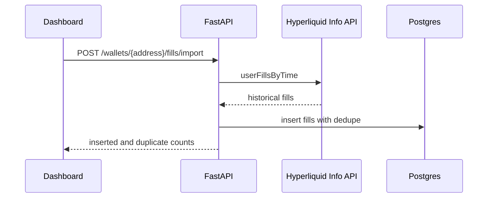
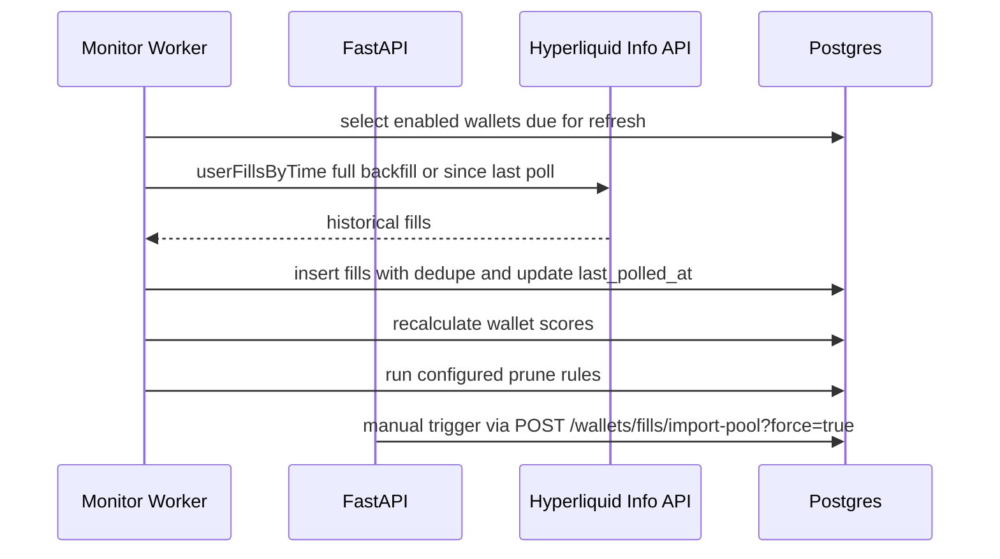
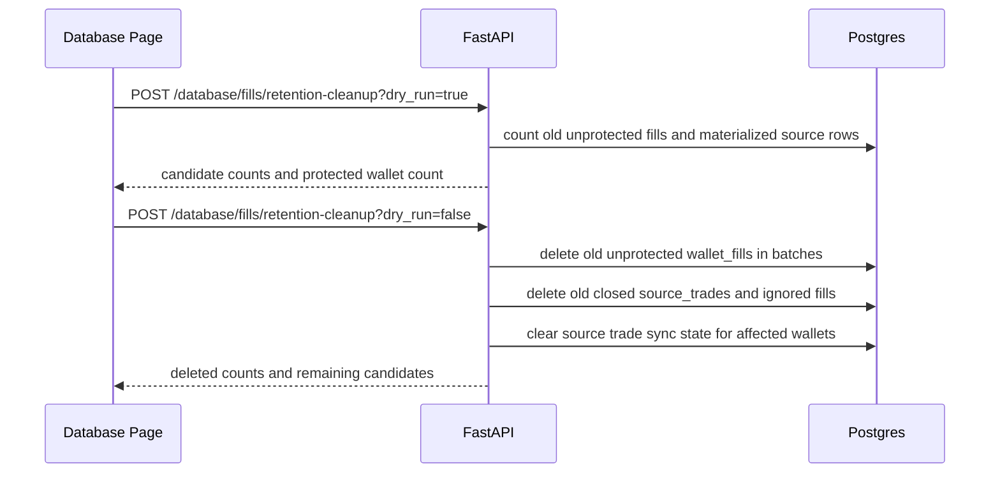
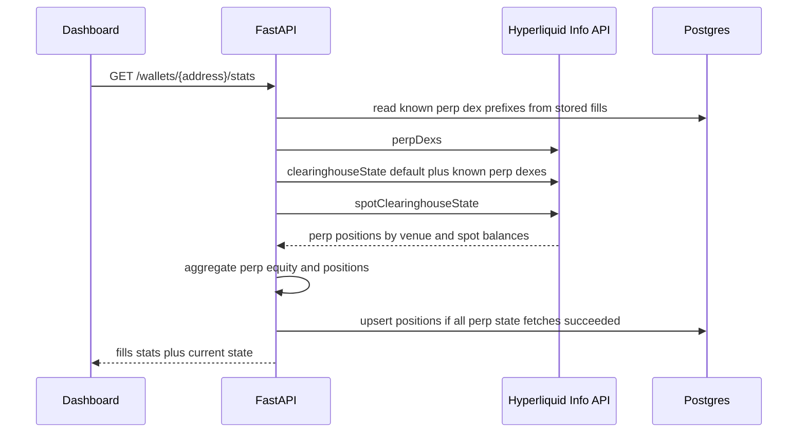
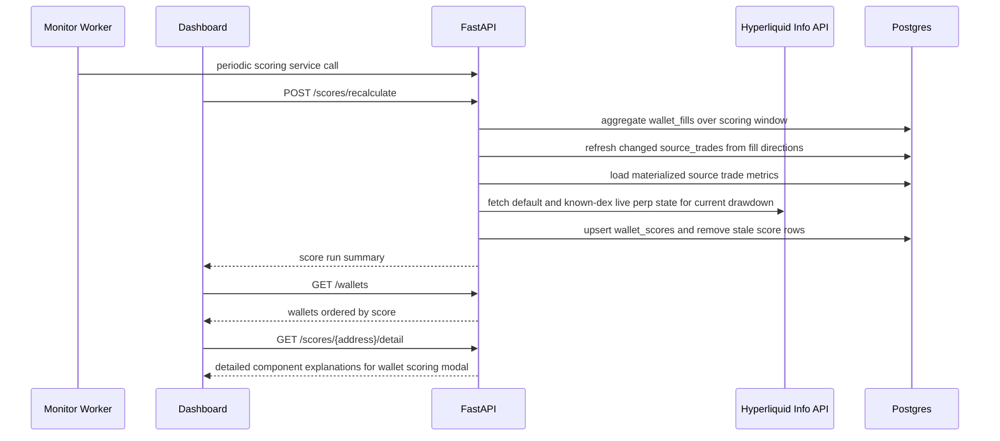
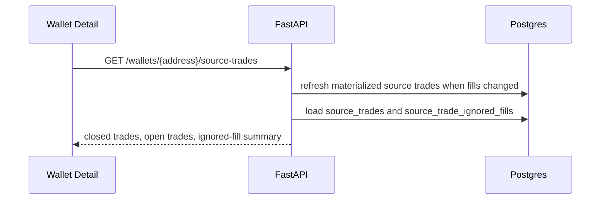
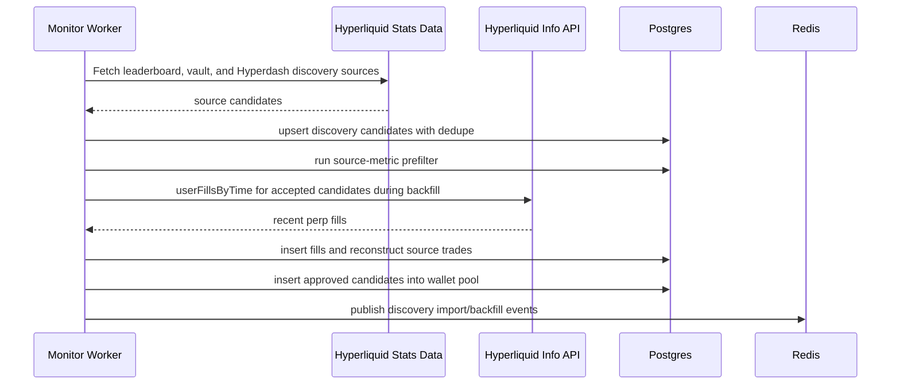
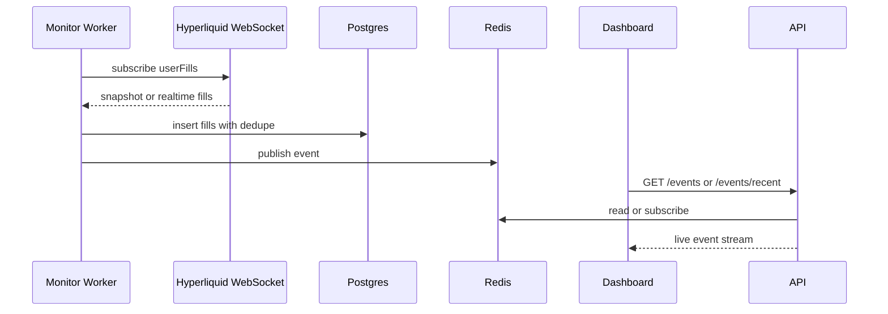
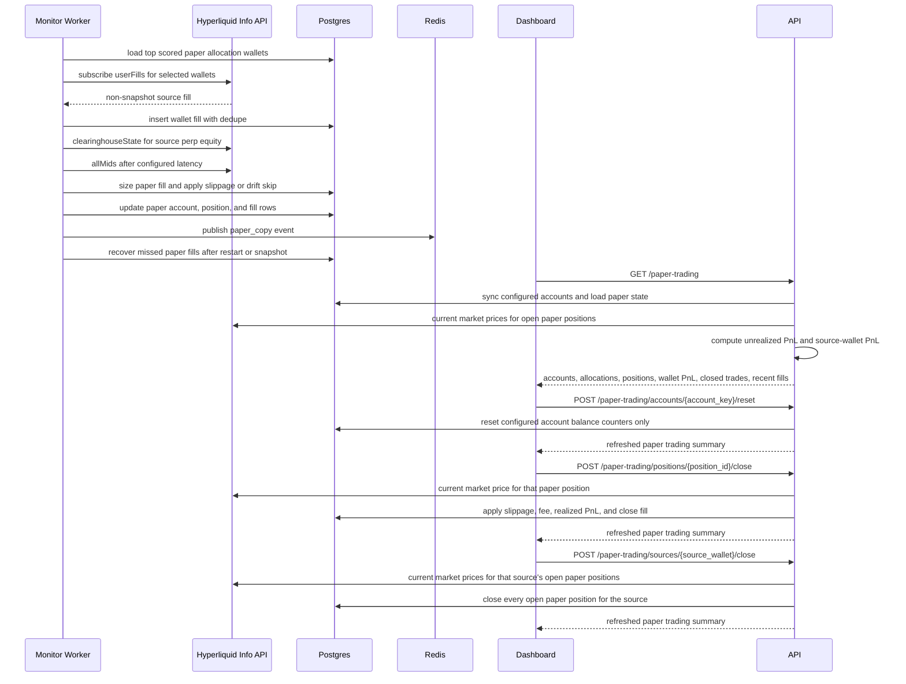

# Architecture

The system is split into a FastAPI backend, reusable Python worker loops, a
Next.js dashboard, Neon Postgres as source of truth, and Redis for runtime
events/cache.


## Root Structure

```text
copytrading-agent/
  backend/
    app/
      api/
      core/
      db/
      integrations/
      schemas/
      services/
      workers/
    config/
      app.json
      discovery.json
      paper_trading.json
      pool_fill_import.json
      prune.json
      scoring.json
  frontend/
    src/
      app/
      components/
      lib/
      types/
    config/
      app.json
  docs/
  infra/
  docker-compose.yml
  .env
```

## Backend

The backend exposes the API used by the dashboard and workers.

Current responsibilities:

- Health checks.
- Wallet CRUD.
- Manual discovery import trigger.
- Historical fill import.
- Fill listing.
- Paper trading summary.
- Realtime event streaming through Server-Sent Events.
- Redis and Postgres integration.
- Dashboard Basic Auth for every route except `/health` and `/ready`.
- Database-backed job locks for discovery, pool import, scoring, and pruning.

Important folders:

- `backend/app/api`: FastAPI routes.
- `backend/app/services`: business logic.
- `backend/app/integrations`: external clients for Hyperliquid and Redis.
- `backend/app/db`: SQLAlchemy models, sessions, and Alembic migrations.
- `backend/config/app.json`: non-secret app/runtime settings.
- `backend/config/discovery.json`: discovery source, filter, backfill, and promotion settings.
- `backend/config/paper_trading.json`: paper accounts and copy allocation policy.
- `backend/config/pool_fill_import.json`: pool reimport and shared fill import settings.
- `backend/config/prune.json`: wallet cleanup and pruning thresholds.
- `backend/config/scoring.json`: scoring windows, weights, and penalty settings.

## Worker

The monitor worker supports explicit roles through `WORKER_ROLE`:

- `all`: starts both trading and maintenance loops in one process.
- `trading`: starts realtime subscriptions and paper-copy recovery only.
- `maintenance`: starts discovery, pool reimport, scoring, and pruning only.

Docker Compose runs `trading-worker` and `maintenance-worker` as separate
services and sets `WORKER_RUN_IN_API_PROCESS=false` on the backend container.
Long-running jobs take rows in `job_locks`, so manual API triggers and worker
services do not run the same long job concurrently.

Trading worker responsibilities:

- Select up to `max_realtime_wallets` wallets. Source wallets with open paper
  positions are retained first, then remaining slots are filled by the highest
  positive wallet scores.
- Paper allocation refresh mirrors that slot model. A source with a realtime
  slot is exposed as `monitorStatus = "monitored"`. A top candidate without a
  free slot is exposed as `monitorStatus = "waiting"` and
  `sourceStatus = "waiting_for_slot"`.
- Subscribe to Hyperliquid `userFills` over WebSocket.
- Store snapshot and realtime fills in Postgres.
- Simulate paper copies for non-snapshot fills from scored allocation wallets.
- Run paper-copy recovery on startup, snapshots, and the configured periodic
  recovery interval.
- Publish system and fill events to Redis.

Maintenance worker responsibilities:

- Run configured discovery imports every 6 hours by default.
- Import candidates from Hyperliquid leaderboard and Hyperdash discovery sources.
- Prefilter source candidates and store discovery run history.
- Backfill approved discovery candidates before they enter the pool.
- Insert candidates that pass backfill quality checks directly into the wallet pool.
- Backfill or incrementally refresh all enabled pool wallets in batches.
- Recalculate scores and run configured prune rules.

The trading worker currently prioritizes wallets in this order:

1. Source wallets with open `paper_positions`
2. Highest positive `wallet_scores.score`
3. `active`
4. `copy_enabled`
5. `candidate`

Plain `pool` wallets can be selected for realtime monitoring when they have a
positive score. This is required for paper-copying the top scored wallets before
full active-set rotation exists. If a monitored wallet falls out of the top 10
while paper positions are still open, it keeps its realtime slot until those
positions are closed. New top 10 wallets wait until a slot is available.

## Frontend

The dashboard is a Next.js app.

Current pages:

- `/`: overview and system status.
- `/wallets`: wallet pool management.
- `/wallets/[address]`: wallet details and recent fills.
- `/live-feed`: realtime system and fill events.
- `/paper-trading`: paper accounts, allocations, positions, and recent paper fills.

Important folders:

- `frontend/src/app`: routes.
- `frontend/src/components`: reusable UI components.
- `frontend/src/lib`: API and config helpers.
- `frontend/src/types`: shared TypeScript types.
- `frontend/config/app.json`: non-secret frontend settings.

Server-side dashboard requests call `serverApiBaseUrl` with a Basic Auth header
from `DASHBOARD_AUTH_USERNAME` and `DASHBOARD_AUTH_PASSWORD`. Browser requests
use `/api/backend`, a Next.js proxy route that attaches the same backend auth on
the server side and streams SSE responses without buffering.

## Data Stores

### Postgres

Postgres is the source of truth.

It stores wallets, fills, positions, scores, active copy set state, copy signals,
copy trades, risk events, settings, job locks, and audit logs.

`wallet_fills` is the largest table. It is optimized as an append-heavy fact
table: rows have a real UUID primary key, dedupe is enforced by wallet address
and non-null external fill ID, and timestamp indexes support wallet detail,
scoring, stats, and source trade reconstruction queries. Raw fill payload
storage is limited to configured fields needed for later signal classification.
By default, historical and realtime fill ingestion stores perp fills only.
Historical import counts `targetFills` after this filter, so a 10k target means
up to 10k stored perp fills even when raw Hyperliquid pages also contain spot
fills.
The Database page also exposes per-index storage and usage stats from Postgres,
so index cost can be reviewed before changing schema. Manual fill retention
cleanup deletes old unprotected `wallet_fills`, old closed `source_trades`, and
old `source_trade_ignored_fills` in batches. It protects active, realtime-slot,
copy-enabled, open paper-position, open position snapshot, and top scored
wallets. Deleted space becomes reusable after vacuum, but total database file
size may not shrink immediately on managed Postgres.

### Redis

Redis is runtime state only.

It is used for:

- Recent live events.
- Pub/sub channels.
- Future queues, kill switch cache, and runtime state.

Redis can be rebuilt from Postgres and Hyperliquid history.

Job locks are stored in Postgres, not Redis, so duplicate prevention survives
Redis restarts and shares the same transactional dependency as wallet data.

## Config Model

Tweakable non-secret config lives in JSON files:

- `backend/config/app.json`
- `backend/config/database.json`
- `backend/config/discovery.json`
- `backend/config/paper_trading.json`
- `backend/config/pool_fill_import.json`
- `backend/config/prune.json`
- `backend/config/scoring.json`
- `frontend/config/app.json`

The backend config files are grouped by operational area:

- `discovery.json` owns source discovery, candidate filtering, backfill quality
  checks, and promotion.
- `database.json` owns manual database maintenance defaults such as fill
  retention days, retention batch size, max rows, and protected top scored
  wallets.
- `pool_fill_import.json` owns scheduled pool reimport and shared fill import
  storage and market-filter settings.
- `scoring.json` owns scoring schedule, score windows, weights, score curves,
  thresholds, and penalties.

Secrets and connection strings live in `.env`:

- `DATABASE_URL`
- `DATABASE_URL_DIRECT`
- `REDIS_URL`
- Hyperliquid private key and wallet address
- dashboard auth credentials

Environment variables override JSON config. This is important in Docker Compose,
where the backend container overrides `worker_run_in_api_process` without editing
`backend/config/app.json`.

## Data Flows

### Historical Fill Import



### Pool Fill Import



The maintenance worker runs the pool maintenance cycle every 30 minutes by
default. A cycle imports all due pool wallets across configured batches,
recalculates wallet scores, and then runs sharp pruning when
`wallet_prune_worker_dry_run` is `false`. Manual pool reimport forces a refresh
regardless of `last_polled_at` and still deduplicates overlapping fills.

### Fill Retention Cleanup



Retention cleanup is manual and uses a database-backed job lock. The default
retention window is 90 days, which is above the default 60 day scoring and pool
import windows. Source trade sync state is cleared for affected wallets so the
next scoring run or wallet detail request rebuilds source trades from retained
fills.

### Wallet Current State



Wallet detail pages show current unrealized drawdown from live perp state.
Score realized drawdown comes from reconstructed closed trades and does not
include intratrade open unrealized PnL.

### Wallet Scoring



Risk score combines realized reconstructed-trade risk with current open perp
drawdown and open-position stress when `scoring_current_drawdown_enabled` is
true. Current drawdown is stored as `wallet_scores.current_drawdown_pct` with
`wallet_scores.current_drawdown_status`. Open-position stress is stored as
`wallet_scores.open_position_stress_pct` and is calculated from live unrealized
loss, margin usage, and notional exposure. If live perp state is incomplete or
perp equity is zero, the scoring run keeps the history-only risk component and
applies the configured missing-state penalty. Scoring only checks default perp
plus dexes already observed in stored fills, so full HIP-3 discovery remains
limited to single-wallet current-state views.
Consistency score uses win rate, profit factor, active days, and profit
distribution. Profit distribution is calculated from winning closed trades as
effective winning trades, `1 / sum(profit_share^2)`, then scored against
the configured profit-winner target. Consistency subweights, win-rate span, and
profit-factor curve are configurable.
Profitability score is scale-invariant. It combines total net ROI against
reconstructed entry notional, capped average trade ROI, and median trade ROI.
The weights are 55/30/15, and each ROI subscore maps 0% or lower to 0 and +5%
to 100. Current-equity return is exposed in the detail modal as reference data
only because deposits and withdrawals can distort it. Absolute net PnL is also
reference data only and does not raise the profitability score.
Risk loss-ratio, realized-drawdown, losing-rate, live drawdown, and position
stress penalty spans are configurable. Copyability trade-count, notional,
concentration, unique-coin spans, and subweights are configurable. Penalty caps
for low sample, stale trading, ignored fills, negative PnL, open-only activity,
liquidations, confidence, and missing live state are configurable.
Wallet detail pages use `GET /scores/{address}/detail` for the Detailed scoring
modal. The endpoint recalculates the current wallet score from the same
materialized trade metrics, then returns gross score, penalty, final score
before sample cap, sample cap, component weights, weighted scores, and
input-level explanations for each scoring part. The modal is explanatory only
and does not write scoring data.
Wallet list and wallet detail responses expose `poolRank`, which is calculated
from the latest stored wallet score ordering and is independent of realtime
monitor slots.
The scoring job lock uses a 30 minute TTL so a killed scoring process does not
block future runs for the longer maintenance lock window.

### Source Trade Detail



### Discovery Pool Admission



### Wallet Pool Pruning

- `POST /wallets/prune-all` is the dashboard-facing pruning entrypoint.
- Orphan-fill pruning removes stored fill data whose wallet address is no longer
  present in `watched_wallets`.
- Zero-fill pruning removes polled wallets that have no stored fill rows at all;
  this replaces the older non-perp cleanup in normal UI workflows.
- Realized drawdown pruning uses stored reconstructed closed-trade scores and
  removes non-active, non-copy wallets at or above the configured drawdown
  threshold.
- Current drawdown pruning checks live Hyperliquid `clearinghouseState` and removes
  non-active, non-copy wallets whose total unrealized perp loss is at least the
  configured share of perp equity.
- Current drawdown fetch errors are reported separately and are never included in
  the delete list.
- High-fill low-score pruning removes polled, scored wallets whose fill count is
  at least the configured minimum and whose final score matches the configured
  cutoff in `backend/config/prune.json`.
- All pruning rules exclude source wallets with open `paper_positions`. Orphan
  fill pruning also keeps fill rows for those sources even if their
  `watched_wallets` row is missing.
- Pruned wallets are also added to the discovery ignore list so scheduled imports
  do not immediately re-add the same address.

### Realtime Monitoring



### Paper Copy Simulation



Paper sizing uses `source fill notional / source perp equity` and applies that
exposure inside each configured source-wallet pocket. Default pockets are 20% for
each top 10 rank, with an 80% total open copied-margin cap per paper account.
Valid source perp equity is required for opens and adds only. Reduce, close, and
flip-close parts are processed against existing paper positions even when the
current Hyperliquid source state reports zero or unavailable perp equity after
the source has exited.
When current drawdown scoring is enabled, paper allocation only selects top
score wallets whose latest `wallet_scores.current_drawdown_status` is `ok`.
The trading worker reads source per-coin leverage from Hyperliquid `clearinghouseState`
and uses `notional / leverage` for margin accounting. If leverage is unavailable
for a coin, paper falls back to 1x. When live mids are enabled, dex-specific
`allMids` and then `metaAndAssetCtxs` are used as fallbacks for `dex:COIN`
markets missing from default `allMids`.
For isolated HIP-3 positions, Hyperliquid `marginSummary.accountValue` can equal
isolated position equity and move with `totalMarginUsed`, so it should not be
read as a stable wallet cash balance.
Opens below the configured minimum notional are skipped before any paper position
is created. Paper execution then waits the configured latency, prices from live
mids when enabled, applies adverse slippage, and skips fills whose observed drift
exceeds the configured max drift limit.
When multiple source fills have the same timestamp, paper-copy processing orders
close and flip-close fills first by descending source `startPosition` before
falling back to the fill id. This keeps large split exits deterministic.

Paper copy state is durable in Postgres. Trading worker restarts keep existing
`paper_positions` and `paper_copy_fills`, retain source wallets with open paper
positions in the copy allocation set, and run recovery after worker start,
WebSocket snapshots, and the configured periodic recovery interval. When a
source has open paper exposure, recovery scans fills from the oldest open paper
position with overlap, then the copied-fill uniqueness constraint prevents
duplicate simulation. Exit skip rows caused by unavailable source state or
unavailable execution price are retriable during recovery so copied positions can
still close after transient data issues.
Allocation refresh also restores open paper-position sources into
`watched_wallets` as neutral `pool` rows if an earlier prune removed the pool
row.
Retained sources outside the current top 10 keep their allocation record only
for managing existing exposure. They can add to matching open paper positions
and can reduce or close them, but new entries are skipped with
`retained_source_new_position_blocked`.
The paper summary reports slot state separately from trade state. Allocation rows
use `monitorStatus` as `monitored` or `waiting`. Wallet PnL history rows use
`monitorStatus` as `monitored` or `history`. `sourceStatus` is `trading`,
`retained`, `waiting_for_trades`, or `waiting_for_slot`.
The dashboard aggregates allocation status across paper accounts when rendering
source rows, so a source is shown as `trading` when at least one account can
open or manage that source and the source has open paper exposure.
The summary also exposes `poolRank` and `sourceStatusReason`. `poolRank` is the
source wallet's score rank in the wallet pool, while `sourceStatusReason`
explains why a source is retained or waiting without relying on monitor-slot
ordering. If a source is a valid copy candidate but a specific paper allocation
is inactive, retained allocation rows report `paper_account_disabled` only when
the paper account is disabled. Otherwise they report `allocation_inactive`.
After replay, recovery fetches the source wallet's live perp state. If an open
paper position no longer has a matching source coin and side, paper closes it at
the current simulated market price with normal fee and slippage. Coin matching
uses the same `dex:COIN` alias handling as market data, so HIP-3 prefixed fills
can match unprefixed live position keys.
The dashboard can also manually close an open paper position. Manual closes use
the same simulated current market price, adverse slippage, and fee model, then
persist a normal `close` fill in `paper_copy_fills` so account PnL and source
wallet history remain durable across restarts.
Copy source rows can also manually close all open paper positions for a selected
source wallet across paper accounts. The source-wide close uses the same manual
close execution model and fails without committing if any required execution
price is unavailable.

Paper copy fill rows store source wallet sizing context in
`paper_copy_fills.source_perp_equity_usd`. The API also exposes
`sourceAccountValueUsd` as a read alias for the same value. Current wallet
position snapshots store Hyperliquid `positionValue` in
`wallet_positions.position_value_usd`, while historical fill notional remains in
`wallet_fills.notional_usd`.
The paper summary exposes closed trade history separately from raw recent fills.
Closed trade rows are derived from paper `close` and `flip_close` executions,
so dashboard trade history is not a skip or fill activity log.
Recent fills remain available in the summary as the diagnostic fill and skip
activity log, and the paper trading page renders them in a separate paginated
list at the bottom of the page.

Discovery candidate source metrics use explicit unit-bearing database columns:
`source_account_value_usd`, `source_pnl_usd`, and `source_roi_pct`.

The paper trading page is a client dashboard that polls the summary API for live
mark prices and unrealized PnL. The API also aggregates source-wallet PnL from
all copied fills, not just the most recent fill rows shown in the UI.
The summary attaches wallet labels to allocation, position, wallet-history,
closed-trade, and recent-fill rows. The UI uses labels as the primary source
name and falls back to the short wallet address. Source rows split realized and
unrealized source PnL, while account-level totals remain split into total,
realized, and unrealized PnL.
Wallet PnL history, closed trade history, and recent fills are shown 10 rows per
page with pagination controls.
Account reset actions restore the configured starting capital and clear
account-level realized PnL and fee counters, but they do not delete open paper
positions, copied fills, or closed trade history.

## Important Constraint

Hyperliquid user-specific WebSocket subscriptions are limited. Realtime monitoring
is reserved for open paper-position sources, the highest scoring paper-copy
candidates, and fallback active wallets. Full-pool analysis should use periodic
historical polling instead.
