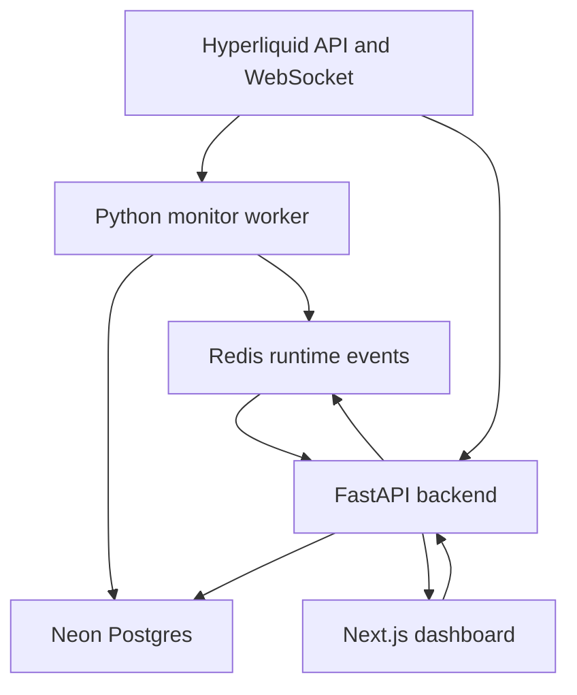
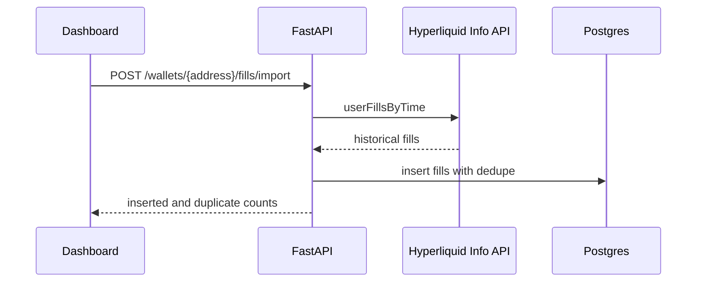
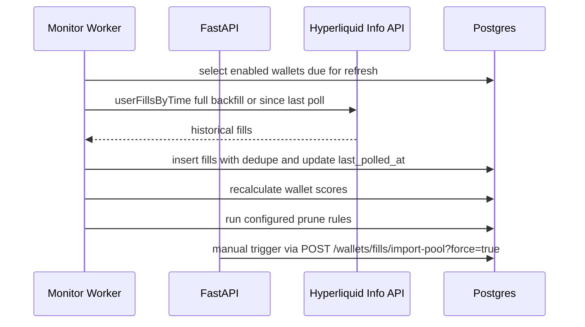
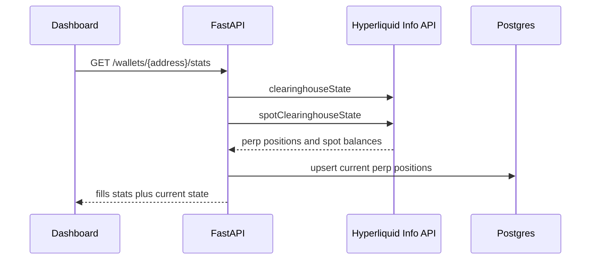
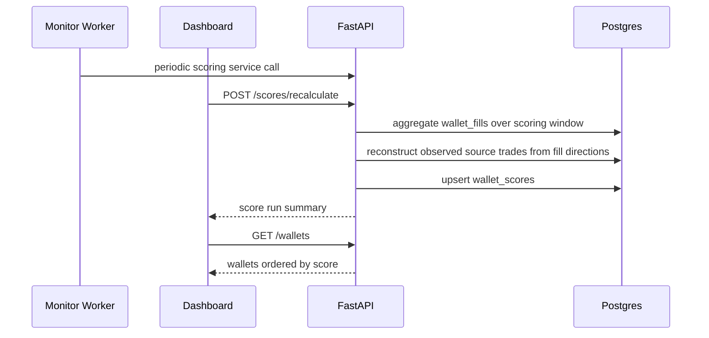
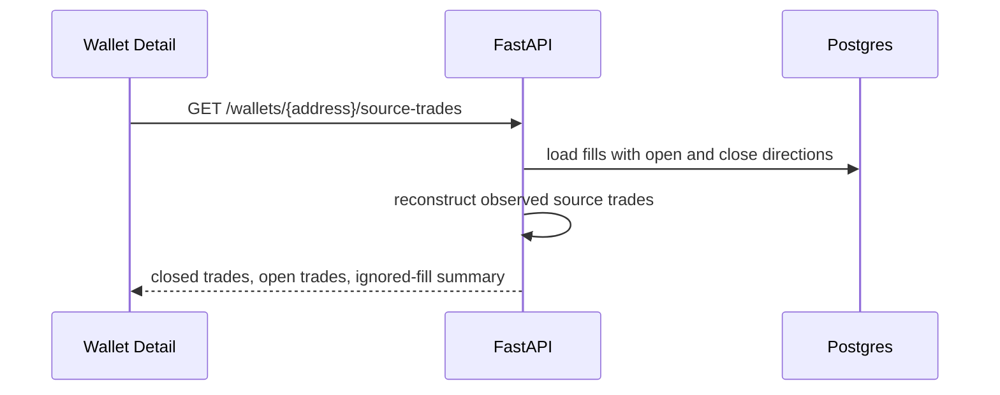
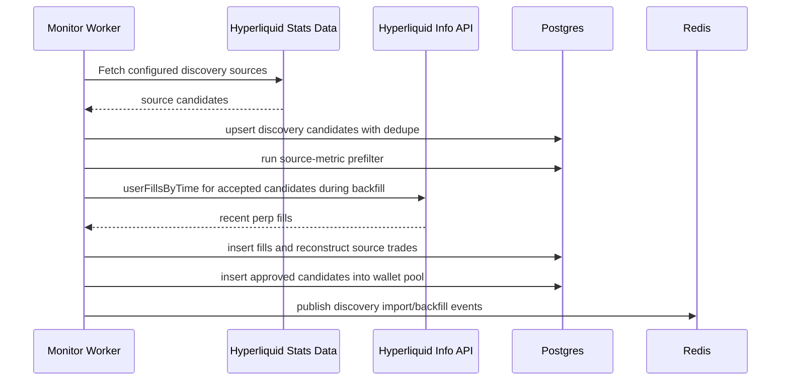
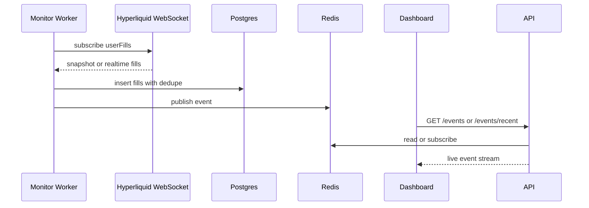

# Architecture

The system is split into a FastAPI backend, reusable Python worker loops, a
Next.js dashboard, Neon Postgres as source of truth, and Redis for runtime
events/cache.



## Root Structure

```text
copytrading-agent/
  backend/
    app/
      api/
      core/
      db/
      integrations/
      schemas/
      services/
      workers/
    config/
      app.json
      discovery.json
      prune.json
      scoring.json
  frontend/
    src/
      app/
      components/
      lib/
      types/
    config/
      app.json
  docs/
  infra/
  docker-compose.yml
  .env
```

## Backend

The backend exposes the API used by the dashboard and workers.

Current responsibilities:

- Health checks.
- Wallet CRUD.
- Manual discovery import trigger.
- Historical fill import.
- Fill listing.
- Realtime event streaming through Server-Sent Events.
- Redis and Postgres integration.

Important folders:

- `backend/app/api`: FastAPI routes.
- `backend/app/services`: business logic.
- `backend/app/integrations`: external clients for Hyperliquid and Redis.
- `backend/app/db`: SQLAlchemy models, sessions, and Alembic migrations.
- `backend/config/app.json`: non-secret app/runtime settings.
- `backend/config/discovery.json`: discovery, import, backfill, and pool refresh settings.
- `backend/config/prune.json`: wallet cleanup and pruning thresholds.
- `backend/config/scoring.json`: scoring windows, weights, and penalty settings.

## Worker

The monitor worker loops can run inside the FastAPI process or as a separate
process. Local development defaults to `worker_run_in_api_process: true`, so
starting the backend also starts discovery, pool reimport, scoring, pruning, and
realtime monitoring. A separate worker process should only be used when that flag
is disabled to avoid duplicate jobs.

Current responsibilities:

- Run configured discovery imports every hour by default.
- Import candidates from Hyperliquid leaderboard and Hyperdash discovery sources.
- Prefilter source candidates and store discovery run history.
- Backfill approved discovery candidates before they enter the pool.
- Insert candidates that pass backfill quality checks directly into the wallet pool.
- Backfill or incrementally refresh all enabled pool wallets in batches.
- Select up to `max_realtime_wallets` enabled wallets.
- Subscribe to Hyperliquid `userFills` over WebSocket.
- Store snapshot and realtime fills in Postgres.
- Publish system and fill events to Redis.
- Refresh subscriptions periodically.

The worker currently prioritizes wallets in this order:

1. `active`
2. `exit_only`
3. `copy_enabled`
4. `candidate`

Plain `pool` wallets are not selected for realtime monitoring until scoring and
active-set rotation promote them.

## Frontend

The dashboard is a Next.js app.

Current pages:

- `/`: overview and system status.
- `/wallets`: wallet pool management.
- `/wallets/[address]`: wallet details and recent fills.
- `/live-feed`: realtime system and fill events.

Important folders:

- `frontend/src/app`: routes.
- `frontend/src/components`: reusable UI components.
- `frontend/src/lib`: API and config helpers.
- `frontend/src/types`: shared TypeScript types.
- `frontend/config/app.json`: non-secret frontend settings.

## Data Stores

### Postgres

Postgres is the source of truth.

It stores wallets, fills, positions, scores, active copy set state, copy signals,
copy trades, risk events, settings, and audit logs.

`wallet_fills` is the largest table. It is optimized as an append-heavy fact
table: dedupe is enforced by wallet address and external fill ID, while raw fill
payload storage is limited to configured fields needed for later signal
classification. By default, historical and realtime fill ingestion stores perp
fills only. Historical import counts `targetFills` after this filter, so a 10k
target means up to 10k stored perp fills even when raw Hyperliquid pages also
contain spot fills.

### Redis

Redis is runtime state only.

It is used for:

- Recent live events.
- Pub/sub channels.
- Future queues, locks, kill switch cache, and runtime state.

Redis can be rebuilt from Postgres and Hyperliquid history.

## Config Model

Tweakable non-secret config lives in JSON files:

- `backend/config/app.json`
- `backend/config/discovery.json`
- `backend/config/prune.json`
- `backend/config/scoring.json`
- `frontend/config/app.json`

Secrets and connection strings live in `.env`:

- `DATABASE_URL`
- `DATABASE_URL_DIRECT`
- `REDIS_URL`
- Hyperliquid private key and wallet address
- dashboard auth credentials

## Data Flows

### Historical Fill Import



### Pool Fill Import



The worker runs the pool maintenance cycle every 10 minutes by default. A cycle
imports all due pool wallets across configured batches, recalculates wallet
scores, and then runs pruning. Manual pool reimport forces a refresh regardless
of `last_polled_at` and still deduplicates overlapping fills.

### Wallet Current State



### Wallet Scoring



### Source Trade Detail



### Leaderboard Pool Import



### Wallet Pool Pruning

- `POST /wallets/prune-all` is the dashboard-facing pruning entrypoint.
- Orphan-fill pruning removes stored fill data whose wallet address is no longer
  present in `watched_wallets`.
- Zero-fill pruning removes polled wallets that have no stored fill rows at all;
  this replaces the older non-perp cleanup in normal UI workflows.
- Historical max drawdown pruning uses stored reconstructed trade scores and
  removes non-active, non-copy wallets at or above the configured max drawdown
  threshold.
- Current drawdown pruning checks live Hyperliquid `clearinghouseState` and removes
  non-active, non-copy wallets whose total unrealized perp loss is at least the
  configured share of account value.
- High-fill low-score pruning removes polled, scored wallets whose fill count is
  at least the configured minimum and whose final score matches the configured
  cutoff in `backend/config/prune.json`.
- Pruned wallets are also added to the leaderboard ignore list so scheduled imports
  do not immediately re-add the same address.

### Realtime Monitoring



## Important Constraint

Hyperliquid user-specific WebSocket subscriptions are limited. Realtime monitoring
is reserved for the active and exit-only set. Full-pool analysis should use
periodic historical polling instead.
