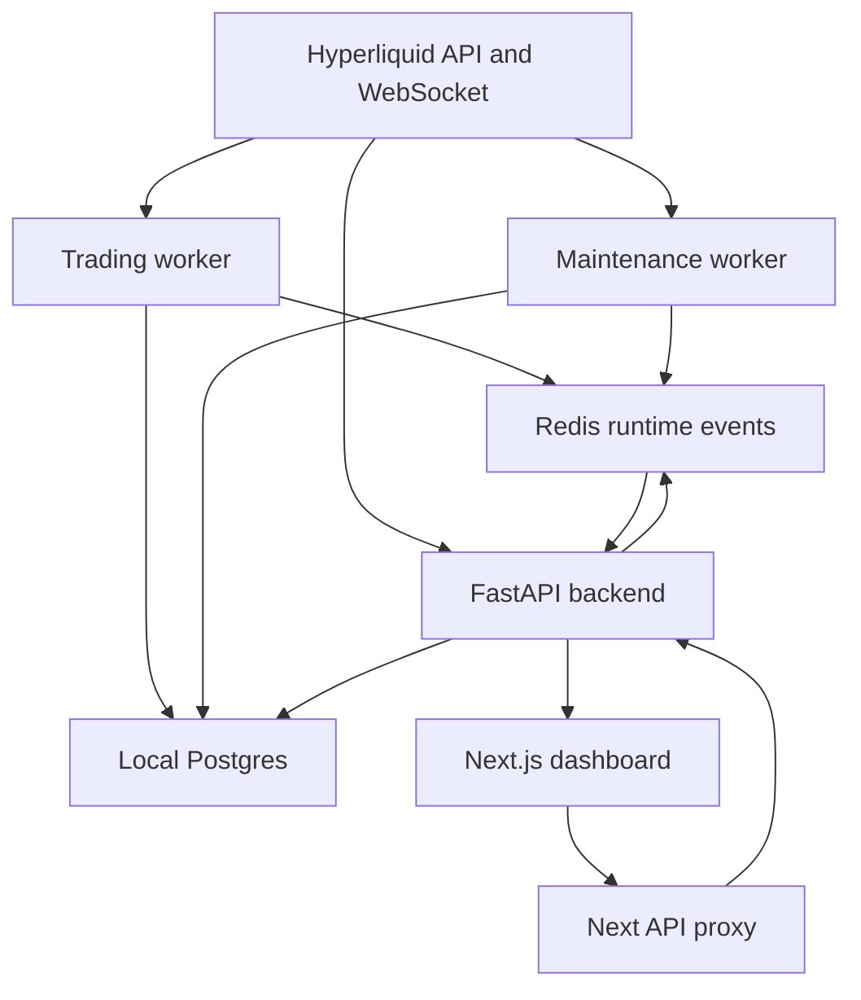
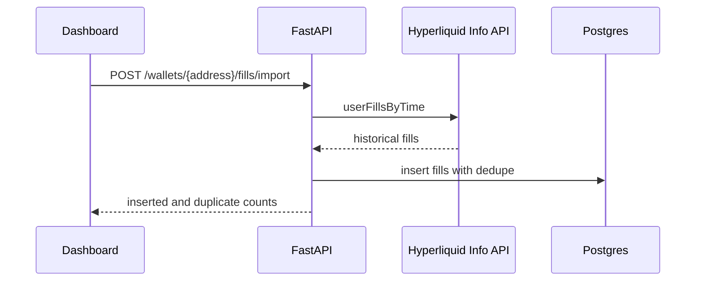
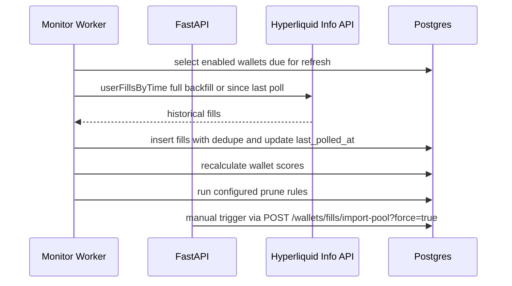
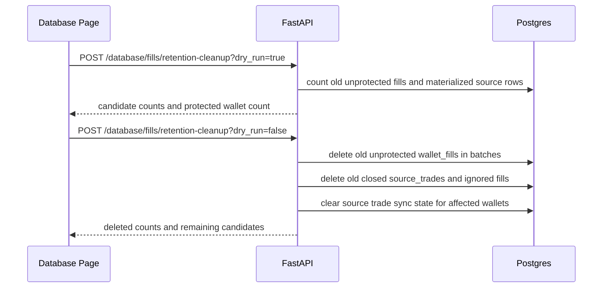
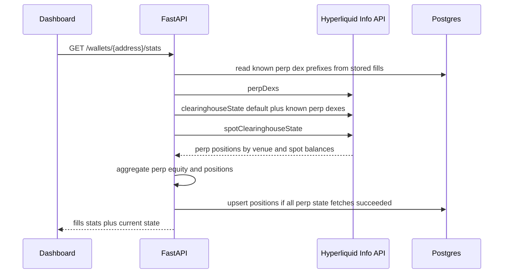
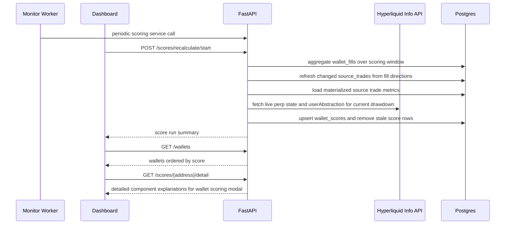
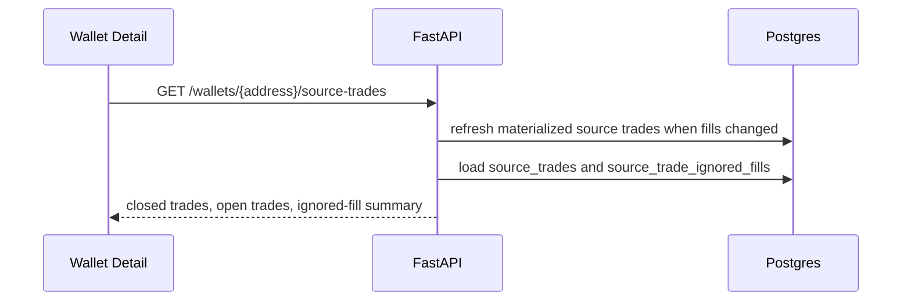
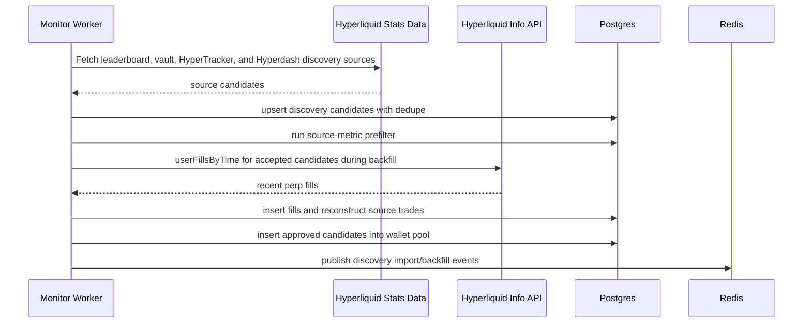
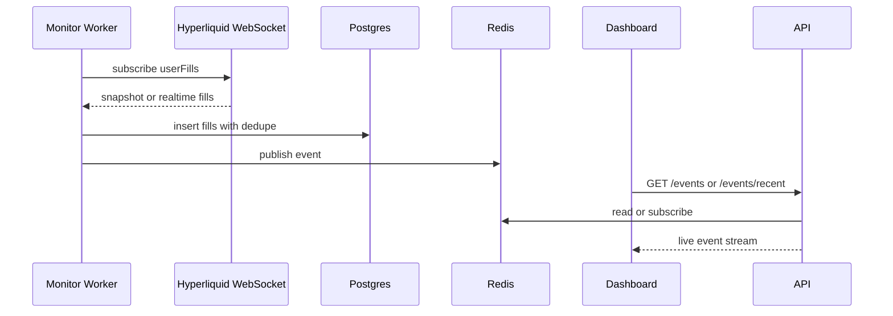
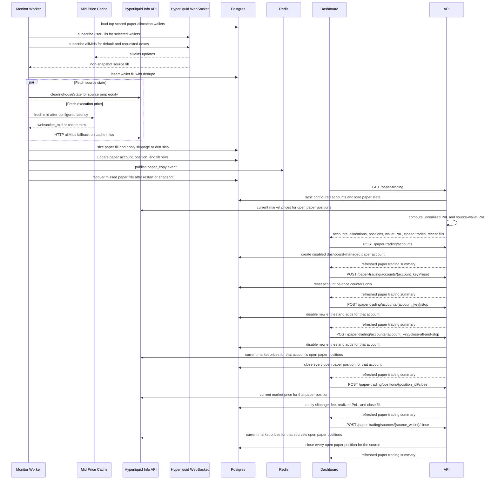

# Architecture

The system is split into a FastAPI backend, reusable Python worker loops, a
Next.js dashboard, local Postgres as source of truth, and Redis for runtime
events/cache.



## Root Structure

```text
copytrading-agent/
  backend/
    app/
      api/
      core/
      db/
      integrations/
      schemas/
      services/
      workers/
    config/
      app.json
      discovery.json
      live_trading.json
      paper_trading.json
      pool_fill_import.json
      prune.json
      scoring.json
      trading.json
  frontend/
    src/
      app/
      components/
      lib/
      types/
    config/
      app.json
  docs/
  infra/
  docker-compose.yml
  .env
```

## Backend

The backend exposes the API used by the dashboard and workers.

Current responsibilities:

- Health checks.
- Wallet CRUD.
- Manual discovery import trigger.
- Historical fill import.
- Fill listing.
- Paper trading summary.
- Live-ready generic trading account registry.
- Realtime event streaming through Server-Sent Events.
- Redis and Postgres integration.
- Dashboard Basic Auth for every route except `/health` and `/ready`.
- Database-backed job locks for discovery, pool import, scoring, and pruning.

Important folders:

- `backend/app/api`: FastAPI routes.
- `backend/app/services`: business logic.
- `backend/app/integrations`: external clients for Hyperliquid and Redis.
- `backend/app/db`: SQLAlchemy models, sessions, and Alembic migrations.
- `backend/config/app.json`: non-secret app/runtime settings.
- `backend/config/discovery.json`: discovery source, filter, backfill, and promotion settings.
- `backend/config/live_trading.json`: live trading enablement and guardrails.
- `backend/config/trading.json`: shared paper and live copy policy.
- `backend/config/paper_trading.json`: paper copy simulation settings.
- `backend/config/pool_fill_import.json`: pool reimport and shared fill import settings.
- `backend/config/prune.json`: wallet cleanup and pruning thresholds.
- `backend/config/scoring.json`: scoring windows, weights, and penalty settings.

## Worker

The monitor worker supports explicit roles through `WORKER_ROLE`:

- `all`: starts both trading and maintenance loops in one process.
- `trading`: starts realtime subscriptions, copy execution, copy recovery, and
  live reconciliation.
- `maintenance`: starts discovery, pool reimport, scoring, and pruning only.

Docker Compose runs `trading-worker` and `maintenance-worker` as separate
services and sets `WORKER_RUN_IN_API_PROCESS=false` on the backend container.
Long-running jobs take rows in `job_locks`, so manual API triggers and worker
services do not run the same long job concurrently. Active jobs renew their lock
TTL, so a long healthy run does not look expired while it is still working.
Workers also update lightweight heartbeat rows in `settings`. The Ops Health
page uses those rows to show whether the trading and maintenance workers are
fresh, stale, or missing.
Long-running operation status is also stored in `settings`. Status writes use a
short transaction with an advisory lock and row-level locking so progress
updates do not overwrite each other when API and worker activity overlap.

Trading worker responsibilities:

- Refresh paper allocations and select up to `max_realtime_wallets` wallets from
  that same allocation result. Source wallets with open paper positions are
  retained first, then remaining slots are filled by the highest scored eligible
  copy candidates.
- A source with a realtime slot is exposed as `monitorStatus = "monitored"`. A
  top candidate without a free slot is exposed as `monitorStatus = "waiting"`
  and `sourceStatus = "waiting_for_slot"`.
- Subscribe to Hyperliquid `userFills` over WebSocket.
- Subscribe to Hyperliquid `allMids` over WebSocket and maintain a short-lived
  price cache for copy execution.
- Store snapshot and realtime fills in Postgres.
- Simulate paper copies for non-snapshot fills from scored allocation wallets.
- Submit live copy orders for non-snapshot fills when live trading and live copy
  execution are enabled.
- Run copy recovery on startup, snapshots, and the configured periodic recovery
  interval.
- Reconcile enabled live accounts when live trading reconciliation is enabled.
- Publish system and fill events to Redis.

Maintenance worker responsibilities:

- Run configured discovery imports every 6 hours by default.
- Import candidates from Hyperliquid leaderboard, HyperTracker segment,
  HyperTracker leaderboard, and Hyperdash discovery sources.
- Prefilter source candidates and store discovery run history.
- Backfill approved discovery candidates before they enter the pool.
- Insert candidates that pass backfill quality checks directly into the wallet pool.
- Backfill or incrementally refresh all enabled pool wallets in batches.
- Recalculate scores and run configured prune rules.

The trading worker does not maintain a separate realtime wallet ranking for
paper copy. The paper allocation refresh is the source of truth for monitored
wallets, dashboard allocation state, and realtime subscription slots. If a
monitored wallet falls out of the top 10 while paper positions are still open,
it keeps management priority until those positions are closed. New top 10
wallets wait until a slot is available.

## Frontend

The dashboard is a Next.js app.

Current pages:

- `/`: overview and system status.
- `/wallets`: wallet pool management.
- `/wallets/[address]`: wallet details and recent fills.
- `/live-feed`: realtime system and fill events.
- `/analytics`: pool, scoring, paper, discovery, and freshness analytics.
- `/accounts`: selected paper or live account metrics, reconciliation, routing,
  positions, closed trades where available, and fills.
- `/trading`: execution cockpit, trading accounts, copy sources, combined paper
  and live positions, and combined recent fills.

Important folders:

- `frontend/src/app`: routes.
- `frontend/src/components`: reusable UI components.
- `frontend/src/lib`: API and config helpers.
- `frontend/src/types`: shared TypeScript types.
- `frontend/config/app.json`: non-secret frontend settings.

The dashboard enforces Basic Auth in Next.js middleware before serving pages or
`/api/backend` proxy routes. Server-side dashboard requests call
`serverApiBaseUrl` with a Basic Auth header from `DASHBOARD_AUTH_USERNAME` and
`DASHBOARD_AUTH_PASSWORD`. Browser requests use `/api/backend`, a Next.js proxy
route that attaches the same backend auth on the server side and streams SSE
responses without buffering.

The Analytics page reads `GET /analytics`. The endpoint intentionally returns
pre-aggregated rows so the dashboard can render pool coverage, score buckets,
opportunity and risk wallet lists, 30D source and coin performance, paper skip
analysis, discovery funnel quality, and freshness checks without issuing many
browser-side API requests.

## Data Stores

### Postgres

Postgres is the source of truth.

It stores wallets, fills, positions, scores, active copy set state, copy signals,
copy trades, risk events, settings, job locks, and audit logs.

`wallet_fills` is the largest table. It is optimized as an append-heavy fact
table: rows have a real UUID primary key, dedupe is enforced by wallet address
and non-null external fill ID, and timestamp indexes support wallet detail,
scoring, stats, and source trade reconstruction queries. Raw fill payload
storage is limited to configured fields needed for later signal classification.
By default, historical and realtime fill ingestion stores perp fills only.
Historical import counts `targetFills` after this filter, so a 10k target means
up to 10k stored perp fills even when raw Hyperliquid pages also contain spot
fills.
The Database page also exposes per-index storage and usage stats from Postgres,
so index cost can be reviewed before changing schema. Manual fill retention
cleanup deletes old unprotected `wallet_fills`, old closed `source_trades`, and
old `source_trade_ignored_fills` in batches. It protects active, realtime-slot,
copy-enabled, open paper-position, open position snapshot, and top scored
wallets. Deleted space becomes reusable after vacuum, but total database file
size may not shrink immediately on managed Postgres.
The Database page also has ignored-fill cleanup. It deletes raw fills that were
classified as pre-existing-position adds or close-only fills and are not needed
for reconstructed source trades. Unmatched close fills are kept when they line up
with a materialized source-trade close, so source trades can still be rebuilt
from retained raw fills.

### Redis

Redis is runtime state only.

It is used for:

- Recent live events.
- Pub/sub channels.
- Future queues, kill switch cache, and runtime state.

Redis can be rebuilt from Postgres and Hyperliquid history.

Job locks are stored in Postgres, not Redis, so duplicate prevention survives
Redis restarts and shares the same transactional dependency as wallet data.

## Config Model

Tweakable non-secret config lives in JSON files:

- `backend/config/app.json`
- `backend/config/database.json`
- `backend/config/discovery.json`
- `backend/config/live_trading.json`
- `backend/config/paper_trading.json`
- `backend/config/pool_fill_import.json`
- `backend/config/prune.json`
- `backend/config/scoring.json`
- `backend/config/trading.json`
- `frontend/config/app.json`

The backend config files are grouped by operational area:

- `discovery.json` owns source discovery, candidate filtering, backfill quality
  checks, and promotion.
- `database.json` owns manual database maintenance defaults such as fill
  retention days, retention batch size, max rows, and protected top scored
  wallets.
- `live_trading.json` owns live trading enablement, acknowledgements, live
  execution guardrails, account risk limits, and market allow/block lists.
- `trading.json` owns copy policy shared by paper and live copy, including
  source ranking limits, allocation pockets, minimum copy notional, optional
  min-order adjustment, price drift guard, and live mid-price cache settings.
- `paper_trading.json` owns paper-only simulation settings such as simulated
  fees, simulated slippage, simulated latency, and recovery cadence.
- `pool_fill_import.json` owns scheduled pool reimport and shared fill import
  storage and market-filter settings.
- `scoring.json` owns scoring schedule, score windows, weights, ratio spans,
  thresholds, and penalties.

Secrets and connection strings live in `.env`:

- `POSTGRES_DB`
- `POSTGRES_USER`
- `POSTGRES_PASSWORD`
- `DATABASE_URL`
- `DATABASE_URL_DIRECT`
- `REDIS_URL`
- Hyperliquid private key and wallet address
- dashboard auth credentials
- backup interval, retention, and status monitoring settings

Docker Compose builds `DATABASE_URL` and `DATABASE_URL_DIRECT` for app
containers from `POSTGRES_*` and the local `postgres` service. Direct database
URLs remain available for non-Compose runs and external Postgres migrations.
Environment variables override JSON config. This is important in Docker Compose,
where the backend container overrides `worker_run_in_api_process` without editing
`backend/config/app.json`.

Docker Compose also runs `postgres-backup`, a lightweight Postgres container
that executes `pg_dump` immediately at startup and then every 24 hours by
default. Dumps are written to `backups/postgres`, and `/ops` reads that mounted
directory for backup freshness.

## Data Flows

### Historical Fill Import



### Pool Fill Import



The maintenance worker runs the pool maintenance cycle every 30 minutes by
default. A cycle imports all due pool wallets across configured batches,
recalculates wallet scores, and then runs sharp pruning when
`wallet_prune_worker_dry_run` is `false`. Manual pool reimport forces a refresh
regardless of `last_polled_at` and still deduplicates overlapping fills.

### Fill Retention Cleanup



Retention cleanup is manual and uses a database-backed job lock. The default
retention window is 90 days, matching the default pool import and candidate
backfill windows. The default scoring window stays 60 days. Source trade sync
state is cleared for affected wallets so the next scoring run or wallet detail
request rebuilds source trades from retained fills.
Ignored-fill cleanup is a separate manual action. It has its own job lock, runs
as dry-run by default, and only deletes raw ignored fills that are not required
for source-trade reconstruction.

### Wallet Current State



Wallet detail pages show current unrealized drawdown from live perp state.
Score realized drawdown comes from reconstructed closed trades and does not
include intratrade open unrealized PnL.

### Wallet Scoring



Risk score combines realized reconstructed-trade risk with current open perp
drawdown and margin stress when `scoring_current_drawdown_enabled` is true.
Current drawdown is stored as `wallet_scores.current_drawdown_pct` with
`wallet_scores.current_drawdown_status`. Margin stress is stored as
`wallet_scores.open_position_stress_pct` and is calculated from live unrealized
loss, margin usage, and notional exposure. Unified wallets use unified USDC from
`spotClearinghouseState` as account value; standard wallets use perps account
value. Live current drawdown can consume the full risk component, and severe
current drawdown also caps the final score. This prevents wallets with perfect
realized win rates from ranking highly while they carry large unrealized losses.
If live state is incomplete or account value is zero, the scoring run keeps the
history-only risk component and applies the configured missing-state penalty.
Scoring only checks default perp plus dexes already observed in stored fills, so
full HIP-3 discovery remains limited to single-wallet current-state views.
By default, current drawdown risk penalty starts at 5 percent and reaches full
penalty at 75 percent. The final score cap starts at 25 percent current drawdown
and reaches zero at 100 percent.
Consistency score measures repeatability and evenness, not profitability or win
rate. It uses profit distribution, largest-win dependency, closed-trade ROI
stability, downside ROI stability, active-day regularity, and max inactive gap.
Profit distribution is calculated from winning closed trades as effective
winning trades, `1 / sum(profit_share^2)`, divided by the number of winning
trades. Win rate and profit factor remain reference stats outside the
consistency component.
Profitability score is scale-invariant. It combines total net ROI against
reconstructed entry notional, capped average trade ROI, and median trade ROI.
The weights are 55/30/15, and each ROI subscore maps 0% or lower to 0 and +3%
to 100. Current-equity return is exposed in the detail modal as reference data
only because deposits and withdrawals can distort it. Absolute net PnL is also
reference data only and does not raise the profitability score.
Recency score uses the latest non-liquidation trading fill in the scoring
window, not only the latest closed reconstructed source trade. Open, add,
reduce, close, and flip fills count as activity, while liquidation fills are
excluded so liquidation events do not create a positive freshness signal.
Risk loss-ratio, realized-drawdown, losing-rate, live drawdown, margin-stress,
and live score-cap thresholds are configurable. Copyability measures practical
followability through copyable trade ratio, median trade notional, p25 trade
notional, and execution simplicity. Trade count is intentionally excluded from
Copyability because sample size is handled by sample caps and the
low-confidence penalty. Penalty caps for low sample, stale trading, negative
PnL, open-only activity, confidence, and missing live state are configurable.
Ignored fills are kept as diagnostic reconstruction metadata and do not reduce
wallet score.
Forced exits are scored inside Risk and Copyability, not as a separate
final-score penalty. Risk includes forced-exit severity, which compares
liquidation-tagged close notional with reconstructed entry notional. Copyability
includes forced-exit fill ratio, which compares liquidation-tagged reconstructed
close fills with total reconstructed close fills. Profitable forced exits still
count as these signals because exact liquidation behavior is difficult to copy.
Materialized `source_trades` rows store liquidation flags, liquidation fill
count, and liquidation notional so wallet source trade history can tag affected
closed trades.
Wallet detail pages use `GET /scores/{address}/detail` for the Detailed scoring
modal. The endpoint recalculates the current wallet score from the same
materialized trade metrics, then returns gross score, penalty, final score
before caps, live risk score cap, sample cap, component weights, weighted
scores, and input-level explanations for each scoring part. The modal is
explanatory only and does not write scoring data.
Wallet list and wallet detail responses expose `poolRank`, which is calculated
from the latest stored wallet score ordering and is independent of realtime
monitor slots.
The scoring job lock uses a 30 minute TTL and renews while scoring is active, so
a killed scoring process does not block future runs and a healthy long scoring
run does not expire mid-run.

### Source Trade Detail



### Discovery Pool Admission



### Wallet Pool Pruning

- `POST /wallets/prune-all` is the dashboard-facing pruning entrypoint.
- Orphan-fill pruning removes stored fill data whose wallet address is no longer
  present in `watched_wallets`.
- Zero-fill pruning removes polled wallets that have no stored fill rows at all;
  this replaces the older non-perp cleanup in normal UI workflows.
- Stale-fill pruning removes polled wallets with stored fills when their latest
  fill is at least the configured inactivity window old. The default is 30 days.
  It requires a poll after that inactivity window elapsed, so stale cleanup does
  not delete wallets solely because their local import state is old.
- Realized drawdown pruning uses stored reconstructed closed-trade scores and
  removes non-active, non-copy wallets at or above the configured drawdown
  threshold.
- Current drawdown pruning checks live Hyperliquid `clearinghouseState` and
  `userAbstraction`, then removes non-active, non-copy wallets whose total
  unrealized perp loss is at least the configured share of account value.
  Unified wallets use unified USDC from `spotClearinghouseState`; standard
  wallets use perps account value.
- Current drawdown fetch errors are reported separately and are never included in
  the delete list.
- Low-score pruning removes polled, scored wallets whose reconstructed closed
  trade count is at least the configured minimum and whose final score matches
  the configured cutoff in `backend/config/prune.json`.
- All pruning rules exclude source wallets with open `paper_positions`. Orphan
  fill pruning also keeps fill rows for those sources even if their
  `watched_wallets` row is missing.
- Pruned wallets are also added to the discovery ignore list so scheduled imports
  do not immediately re-add the same address.

### Realtime Monitoring



### Paper Copy Simulation



Paper sizing uses `source fill notional / source perp equity` and applies that
exposure inside each configured source-wallet pocket. Default pockets are 20% for
each top 10 rank, with an 80% total open copied-margin cap per paper account.
Valid source perp equity is required for opens and adds only. Reduce, close, and
flip-close parts are processed against existing paper positions even when the
current Hyperliquid source state reports zero or unavailable perp equity after
the source has exited. If a source wallet reports zero per-dex perp equity and
Hyperliquid `userAbstraction` reports a unified account, source sizing uses
unified USDC from `spotClearinghouseState`.
When current drawdown scoring is enabled, paper allocation only selects top
score wallets whose latest `wallet_scores.current_drawdown_status` is `ok`.
The trading worker reads source per-coin leverage from Hyperliquid `clearinghouseState`
and uses `notional / leverage` for margin accounting. If leverage is unavailable
for a coin, paper falls back to 1x. When live mids are enabled, a WebSocket
`allMids` cache is used first. HTTP `allMids`, dex-specific `allMids`, and then
`metaAndAssetCtxs` are used as fallbacks for stale or missing cached prices.
When a `dex:COIN` fill misses cache, the worker requests a matching dex-specific
WebSocket `allMids` subscription so later fills can use cached prices.
For isolated HIP-3 positions, Hyperliquid `marginSummary.accountValue` can equal
isolated position equity and move with `totalMarginUsed`, so it should not be
read as a stable wallet cash balance.
Opens or adds below the configured minimum notional are adjusted up to the
minimum when `trading_copy_adjust_small_orders_to_min_order` is enabled and the
source and account caps can fit the adjusted margin. Otherwise they are skipped
before any paper position is created. The default minimum is 10 USD to match
Hyperliquid's live perp minimum order value. Paper execution starts the
configured latency while source account state is fetched in parallel, then
prices from live mids when enabled, applies adverse slippage, and skips fills
whose observed drift exceeds the configured max drift limit. The default latency
is 250 ms and the default max drift limit is 50 bps. Paper fees use Hyperliquid's
base perp taker fee by default, 0.045%, because paper execution models immediate
taker-style fills rather than resting maker orders.
Stored paper position notional and margin represent simulated entry exposure.
Adds increase stored margin by the new fill margin, and partial closes reduce
stored margin proportionally. Current notional is calculated separately from mark
price for live unrealized PnL.
Open position summaries expose entry execution delay as `created_at - opened_at`,
where `opened_at` is the source fill timestamp and `created_at` is when the
paper position row was created.
When multiple source fills have the same timestamp, paper-copy processing orders
close and flip-close fills first by descending source `startPosition` before
falling back to the fill id. This keeps large split exits deterministic.

Paper copy state is durable in Postgres. Trading worker restarts keep existing
`paper_positions` and `paper_copy_fills`, retain source wallets with open paper
positions in the copy allocation set, and run recovery after worker start,
WebSocket snapshots, and the configured periodic recovery interval. Recovery
focuses on sources with open paper positions and current monitored allocation
sources instead of scanning every historical paper-fill source. For open
exposure sources, recovery scans fills from the oldest open paper position with
overlap, then the copied-fill uniqueness constraint prevents duplicate
simulation. Exit skip rows caused by unavailable source state or unavailable
execution price are retriable during recovery so copied positions can still
close after transient data issues.
Paper-copy mutations also take a Postgres advisory transaction lock per source
wallet. That serializes realtime fill processing, recovery reconciliation, and
manual closes for the same source exposure.
Paper account rows are locked before copied fills are written, so different
source wallets cannot concurrently update the same paper account balance.
Successful paper fills also store a `raw_payload.tradeIntent` object from the
shared trading core. That intent contains side, action, size, notional, limit
price, reduce-only state, and deterministic client order id, so live execution
can consume the same planned order shape that paper simulation uses.
Allocation refresh also restores open paper-position sources into
`watched_wallets` as neutral `pool` rows if an earlier prune removed the pool
row.
Retained sources outside the current top 10 keep their allocation record only
for managing existing exposure. They can add to matching open paper positions
and can reduce or close them, but new entries are skipped with
`retained_source_new_position_blocked`.
The paper summary reports slot state separately from trade state. Allocation rows
use `monitorStatus` as `monitored` or `waiting`. Wallet PnL history rows use
`monitorStatus` as `monitored` or `history`. `sourceStatus` is `trading`,
`retained`, `waiting_for_trades`, or `waiting_for_slot`.
The dashboard aggregates allocation status across paper accounts when rendering
source rows, so a source is shown as `trading` when at least one account can
open or manage that source and the source has open paper exposure.
Paper account `enabled` is database runtime state after the account has been
created through the dashboard or API. The Accounts page can create paper
accounts with a selected USD starting balance and live accounts with a wallet
name, optional wallet address, and optional vault address. Empty wallet address
fields use and save `HYPERLIQUID_WALLET_ADDRESS`. Live account keys are
generated internally from the wallet route, so the display name can change
without creating a duplicate route. New accounts start disabled and reconcile
the exchange wallet snapshot immediately so equity, balance, and open live
positions are visible before trading is started. The live Reconciled card can
also manually refresh the selected live account snapshot. The Accounts page can
change enabled state for one account without disabling other accounts.
Disabled paper accounts are excluded from new entries and adds, but are still
included when an existing open position for the source needs a reduce or exit
fill. Live accounts use `enabled`, `exit_only`, and `disabled` status. The
close-all-and-stop route sets the selected account to exit-only first, closes
open positions for that account, and disables the account after successful
close submission. Account deletion removes local database state for the
selected account. Paper deletion removes paper positions, fills, allocations,
and account history. Live deletion removes local live account, order, fill, and
position snapshots only, requires the account to be stopped first, and does not
close exchange positions.
The summary also exposes `poolRank` and `sourceStatusReason`. `poolRank` is the
source wallet's score rank in the wallet pool, while `sourceStatusReason`
explains why a source is retained or waiting without relying on monitor-slot
ordering. If a source is a valid copy candidate but a specific paper allocation
is inactive, retained allocation rows report `paper_account_disabled` only when
the paper account is disabled. Otherwise they report `allocation_inactive`.
After replay, recovery fetches the source wallet's live perp state. If an open
paper position no longer has a matching source coin and side, paper closes it at
the current simulated market price with normal fee and slippage. Coin matching
uses the same `dex:COIN` alias handling as market data, so HIP-3 prefixed fills
can match unprefixed live position keys.
The dashboard can also manually close an open paper position. Manual closes use
the same simulated current market price, adverse slippage, and fee model, then
persist a normal `close` fill in `paper_copy_fills` so account PnL and source
wallet history remain durable across restarts.
Copy source rows can also manually close all open paper positions for a selected
source wallet across paper accounts. The source-wide close uses the same manual
close execution model and fails without committing if any required execution
price is unavailable.

Paper copy fill rows store source wallet sizing context in
`paper_copy_fills.source_perp_equity_usd`. The API also exposes
`sourceAccountValueUsd` as a read alias for the same value. Current wallet
position snapshots store Hyperliquid `positionValue` in
`wallet_positions.position_value_usd`, while historical fill notional remains in
`wallet_fills.notional_usd`.

### Live-Ready Trading Core

The backend separates copied order planning from execution. The shared
`trading_core` module produces `TradeIntent` objects and shared sizing helpers.
Paper execution consumes those intents through the existing paper simulator.
Live execution has a separate Hyperliquid adapter. The trading worker executes
live copy only when global live trading, copy execution, and the selected live
account are enabled. It can also reconcile enabled live accounts when live
trading is enabled.

Generic live-ready tables sit beside the legacy paper tables:

- `trading_accounts`: paper and live account registry with status, network,
  wallet address, vault address, and account PnL fields.
- `trading_positions`: account/source/coin position state for live copy and
  reconciliation.
- `trading_orders`: idempotent order records keyed by deterministic client order
  id and source fill sequence.
- `trading_fills`: reconciled exchange fill records.

Existing paper accounts are mirrored into `trading_accounts`. A stopped paper
account is mirrored as `exit_only` because copied exits and reductions are still
allowed after new entries are disabled.

The Hyperliquid live adapter uses the official Python SDK at execution time. It
submits IOC limit orders with deterministic client order ids and supports
reduce-only orders. It refuses to submit unless live trading is enabled,
acknowledged, the account network matches the configured network, account
status allows the requested intent, and the intent is a live intent for that
account. Mainnet also requires `live_trading_mainnet_acknowledged=true`.
Automatic copied live entries also pass account-level guardrails for max order
notional, max account open notional, max open positions, max daily loss, max
orders per minute, and market allow/block lists.
Live capital mode is config-driven. `unified` uses Hyperliquid
`spotClearinghouseState` as the balance source of truth for equity, cash, Start
trading validation, and live copy sizing. `standard_per_dex` keeps separate
default and HIP-3 perp capital, and copied entries size from the same perp dex
as the copied market.

Live order lifecycle is persisted in `trading_orders`. Orders move from
`planned` to `submitted`, then to `accepted`, `rejected`, `filled`,
`partially_filled`, `canceled`, or `failed` based on Hyperliquid responses and
reconciliation. Reconciliation resumes after restart by querying `orderStatus`
with the stored oid or deterministic cloid, importing `userFillsByTime` rows
into `trading_fills`, and syncing aggregate account positions from
`clearinghouseState` into `trading_positions` with source wallet
`__exchange__`.

Live fill reconciliation also updates source-attributed live positions for
matched copied orders. Those source positions let exit-only accounts continue
to reduce or close copied exposure without allowing new entries.

The paper summary exposes closed trade history separately from raw recent fills.
Closed trade rows are derived from paper `close` and `flip_close` executions,
so dashboard trade history is not a skip or fill activity log. The summary also
matches closed paper fills back to original source fills and marks rows whose
source close fill was a Hyperliquid liquidation.
Recent fills remain available in the summary as the diagnostic fill and skip
activity log, and the Trading page renders them in a separate paginated
list at the bottom of the page.

Discovery candidate source metrics use explicit unit-bearing database columns:
`source_account_value_usd`, `source_pnl_usd`, and `source_roi_pct`.

The Trading page is a client dashboard that polls the paper summary API for
paper marks, paper unrealized PnL, and source-wallet paper PnL, and also polls
the generic trading account API for live accounts, live positions, and recent
live fills. The UI uses paper wallet labels as the primary source names where
available and falls back to the short wallet address. Source rows split paper
realized and unrealized source PnL, while top account and position sections
combine paper and live state. Paper closed trades and recent fills are shown 10
rows per page with pagination controls, and recent fills include both paper fill
activity and live reconciled fills.
Account reset actions restore the configured starting capital and clear
account-level realized PnL and fee counters, but they do not delete open paper
positions, copied fills, or closed trade history.

## Important Constraint

Hyperliquid user-specific WebSocket subscriptions are limited. Realtime
monitoring is reserved for open copy-exposure sources, the highest scoring copy
candidates, and fallback active wallets. Full-pool analysis should use periodic
historical polling instead.
