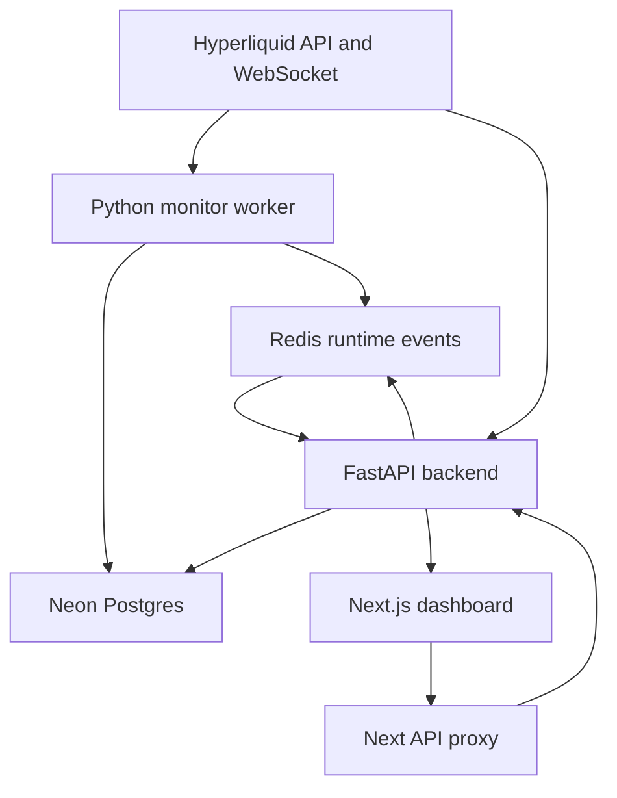
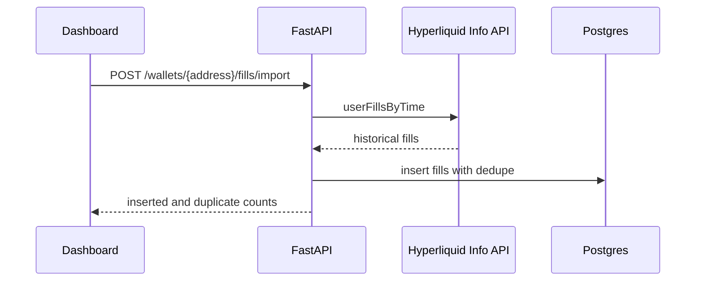
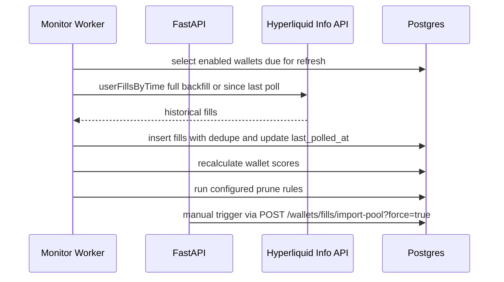
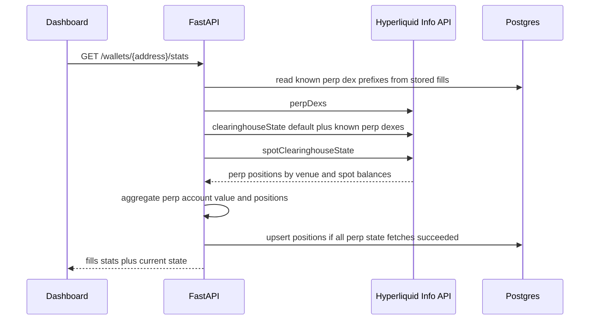
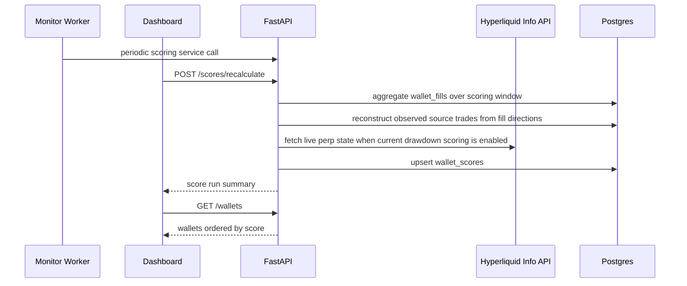
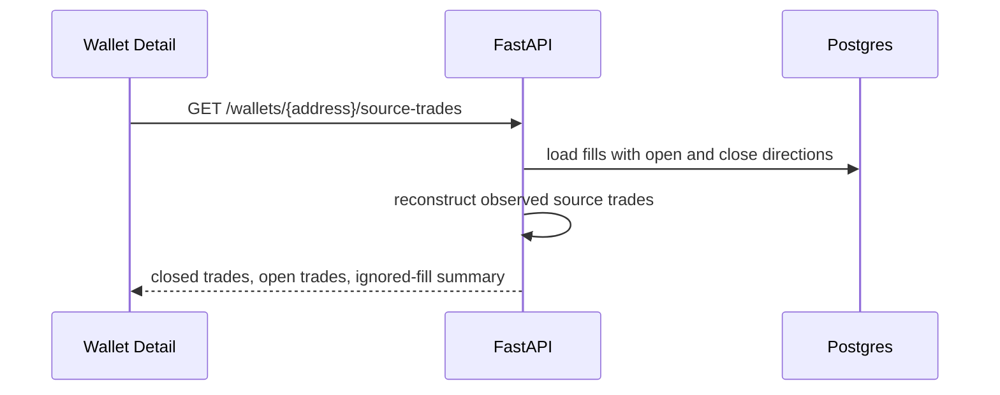
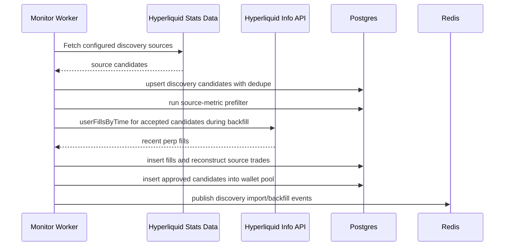
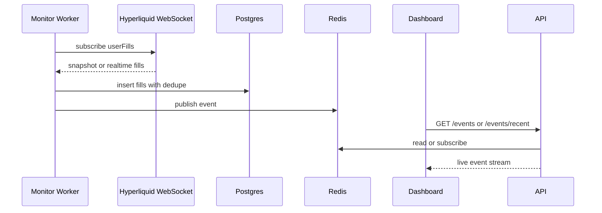
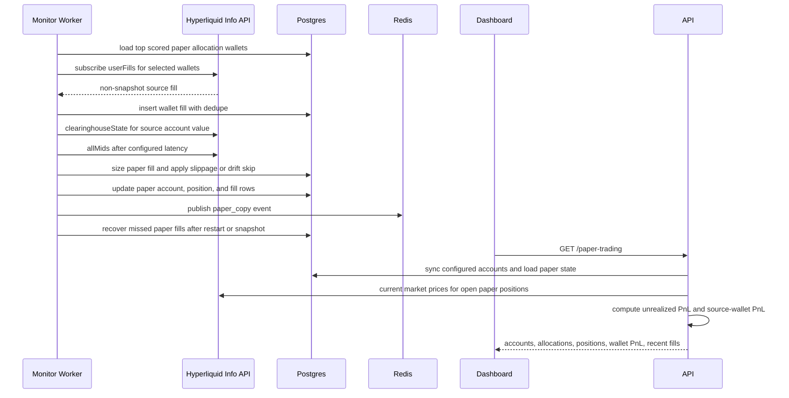

# Architecture

The system is split into a FastAPI backend, reusable Python worker loops, a
Next.js dashboard, Neon Postgres as source of truth, and Redis for runtime
events/cache.



## Root Structure

```text
copytrading-agent/
  backend/
    app/
      api/
      core/
      db/
      integrations/
      schemas/
      services/
      workers/
    config/
      app.json
      discovery.json
      paper_trading.json
      prune.json
      scoring.json
  frontend/
    src/
      app/
      components/
      lib/
      types/
    config/
      app.json
  docs/
  infra/
  docker-compose.yml
  .env
```

## Backend

The backend exposes the API used by the dashboard and workers.

Current responsibilities:

- Health checks.
- Wallet CRUD.
- Manual discovery import trigger.
- Historical fill import.
- Fill listing.
- Paper trading summary.
- Realtime event streaming through Server-Sent Events.
- Redis and Postgres integration.
- Dashboard Basic Auth for every route except `/health` and `/ready`.
- Database-backed job locks for discovery, pool import, scoring, and pruning.

Important folders:

- `backend/app/api`: FastAPI routes.
- `backend/app/services`: business logic.
- `backend/app/integrations`: external clients for Hyperliquid and Redis.
- `backend/app/db`: SQLAlchemy models, sessions, and Alembic migrations.
- `backend/config/app.json`: non-secret app/runtime settings.
- `backend/config/discovery.json`: discovery, import, backfill, and pool refresh settings.
- `backend/config/paper_trading.json`: paper accounts and copy allocation policy.
- `backend/config/prune.json`: wallet cleanup and pruning thresholds.
- `backend/config/scoring.json`: scoring windows, weights, and penalty settings.

## Worker

The monitor worker loops can run inside the FastAPI process or as a separate
process. Local development defaults to `worker_run_in_api_process: true`, so
starting the backend also starts discovery, pool reimport, scoring, pruning, and
realtime monitoring. A separate worker process should only be used when that flag
is disabled to avoid duplicate jobs.

Docker Compose uses the separate `worker` service and sets
`WORKER_RUN_IN_API_PROCESS=false` on the backend container. Long-running jobs also
take rows in `job_locks`, so manual API triggers, the API process, and the worker
service do not run the same job concurrently.

Current responsibilities:

- Run configured discovery imports every 6 hours by default.
- Import candidates from Hyperliquid leaderboard and Hyperdash discovery sources.
- Prefilter source candidates and store discovery run history.
- Backfill approved discovery candidates before they enter the pool.
- Insert candidates that pass backfill quality checks directly into the wallet pool.
- Backfill or incrementally refresh all enabled pool wallets in batches.
- Select up to `max_realtime_wallets` wallets. Source wallets with open paper
  positions are retained first, then remaining slots are filled by the highest
  positive wallet scores.
- Subscribe to Hyperliquid `userFills` over WebSocket.
- Store snapshot and realtime fills in Postgres.
- Simulate paper copies for non-snapshot fills from scored allocation wallets.
- Publish system and fill events to Redis.
- Refresh subscriptions periodically.

The worker currently prioritizes wallets in this order:

1. Source wallets with open `paper_positions`
2. Highest positive `wallet_scores.score`
3. `active`
4. `exit_only`
5. `copy_enabled`
6. `candidate`

Plain `pool` wallets can be selected for realtime monitoring when they have a
positive score. This is required for paper-copying the top scored wallets before
full active-set rotation exists. If a monitored wallet falls out of the top 10
while paper positions are still open, it keeps its realtime slot until those
positions are closed. New top 10 wallets wait until a slot is available.

## Frontend

The dashboard is a Next.js app.

Current pages:

- `/`: overview and system status.
- `/wallets`: wallet pool management.
- `/wallets/[address]`: wallet details and recent fills.
- `/live-feed`: realtime system and fill events.
- `/paper-trading`: paper accounts, allocations, positions, and recent paper fills.

Important folders:

- `frontend/src/app`: routes.
- `frontend/src/components`: reusable UI components.
- `frontend/src/lib`: API and config helpers.
- `frontend/src/types`: shared TypeScript types.
- `frontend/config/app.json`: non-secret frontend settings.

Server-side dashboard requests call `serverApiBaseUrl` with a Basic Auth header
from `DASHBOARD_AUTH_USERNAME` and `DASHBOARD_AUTH_PASSWORD`. Browser requests
use `/api/backend`, a Next.js proxy route that attaches the same backend auth on
the server side and streams SSE responses without buffering.

## Data Stores

### Postgres

Postgres is the source of truth.

It stores wallets, fills, positions, scores, active copy set state, copy signals,
copy trades, risk events, settings, job locks, and audit logs.

`wallet_fills` is the largest table. It is optimized as an append-heavy fact
table: rows have a real UUID primary key, dedupe is enforced by wallet address
and non-null external fill ID, and timestamp indexes support wallet detail,
scoring, stats, and source trade reconstruction queries. Raw fill payload
storage is limited to configured fields needed for later signal classification.
By default, historical and realtime fill ingestion stores perp fills only.
Historical import counts `targetFills` after this filter, so a 10k target means
up to 10k stored perp fills even when raw Hyperliquid pages also contain spot
fills.

### Redis

Redis is runtime state only.

It is used for:

- Recent live events.
- Pub/sub channels.
- Future queues, kill switch cache, and runtime state.

Redis can be rebuilt from Postgres and Hyperliquid history.

Job locks are stored in Postgres, not Redis, so duplicate prevention survives
Redis restarts and shares the same transactional dependency as wallet data.

## Config Model

Tweakable non-secret config lives in JSON files:

- `backend/config/app.json`
- `backend/config/discovery.json`
- `backend/config/paper_trading.json`
- `backend/config/prune.json`
- `backend/config/scoring.json`
- `frontend/config/app.json`

Secrets and connection strings live in `.env`:

- `DATABASE_URL`
- `DATABASE_URL_DIRECT`
- `REDIS_URL`
- Hyperliquid private key and wallet address
- dashboard auth credentials

Environment variables override JSON config. This is important in Docker Compose,
where the backend container overrides `worker_run_in_api_process` without editing
`backend/config/app.json`.

## Data Flows

### Historical Fill Import



### Pool Fill Import



The worker runs the pool maintenance cycle every 30 minutes by default. A cycle
imports all due pool wallets across configured batches, recalculates wallet
scores, and then runs sharp pruning when `wallet_prune_worker_dry_run` is
`false`. Manual pool reimport forces a refresh regardless of `last_polled_at`
and still deduplicates overlapping fills.

### Wallet Current State



Wallet detail pages show current unrealized drawdown from live perp state.
Score max drawdown remains a historical realized metric from reconstructed
closed trades and does not include current open unrealized PnL.

### Wallet Scoring



Risk score combines historical reconstructed-trade risk with current open perp
drawdown when `scoring_current_drawdown_enabled` is true. Current drawdown is
stored as `wallet_scores.current_drawdown_pct`; if live perp state is incomplete,
the scoring run keeps the history-only risk score for that wallet.

### Source Trade Detail



### Leaderboard Pool Import



### Wallet Pool Pruning

- `POST /wallets/prune-all` is the dashboard-facing pruning entrypoint.
- Orphan-fill pruning removes stored fill data whose wallet address is no longer
  present in `watched_wallets`.
- Zero-fill pruning removes polled wallets that have no stored fill rows at all;
  this replaces the older non-perp cleanup in normal UI workflows.
- Historical max drawdown pruning uses stored reconstructed trade scores and
  removes non-active, non-copy wallets at or above the configured max drawdown
  threshold.
- Current drawdown pruning checks live Hyperliquid `clearinghouseState` and removes
  non-active, non-copy wallets whose total unrealized perp loss is at least the
  configured share of account value.
- Current drawdown fetch errors are reported separately and are never included in
  the delete list.
- High-fill low-score pruning removes polled, scored wallets whose fill count is
  at least the configured minimum and whose final score matches the configured
  cutoff in `backend/config/prune.json`.
- Pruned wallets are also added to the leaderboard ignore list so scheduled imports
  do not immediately re-add the same address.

### Realtime Monitoring



### Paper Copy Simulation



Paper sizing uses `source fill notional / source account value` and applies that
exposure inside each configured source-wallet pocket. Default pockets are 20% for
each top 10 rank, with an 80% total open copied-margin cap per paper account.
The worker reads source per-coin leverage from Hyperliquid `clearinghouseState`
and uses `notional / leverage` for margin accounting. If leverage is unavailable
for a coin, paper falls back to 1x. When live mids are enabled, dex-specific
`allMids` and then `metaAndAssetCtxs` are used as fallbacks for `dex:COIN`
markets missing from default `allMids`.
Opens below the configured minimum notional are skipped before any paper position
is created. Paper execution then waits the configured latency, prices from live
mids when enabled, applies adverse slippage, and skips fills whose observed drift
exceeds the configured max drift limit.

Paper copy state is durable in Postgres. Worker restarts keep existing
`paper_positions` and `paper_copy_fills`, retain source wallets with open paper
positions in the copy allocation set, and run recovery after worker start,
WebSocket snapshots, and pool imports. Recovery scans fills after the latest
copied source fill with overlap, then the copied-fill uniqueness constraint
prevents duplicate simulation.

The paper trading page is a client dashboard that polls the summary API for live
mark prices and unrealized PnL. The API also aggregates source-wallet PnL from
all copied fills, not just the most recent fill rows shown in the UI.

## Important Constraint

Hyperliquid user-specific WebSocket subscriptions are limited. Realtime monitoring
is reserved for open paper-position sources, the highest scoring paper-copy
candidates, and fallback active wallets. Full-pool analysis should use periodic
historical polling instead.
