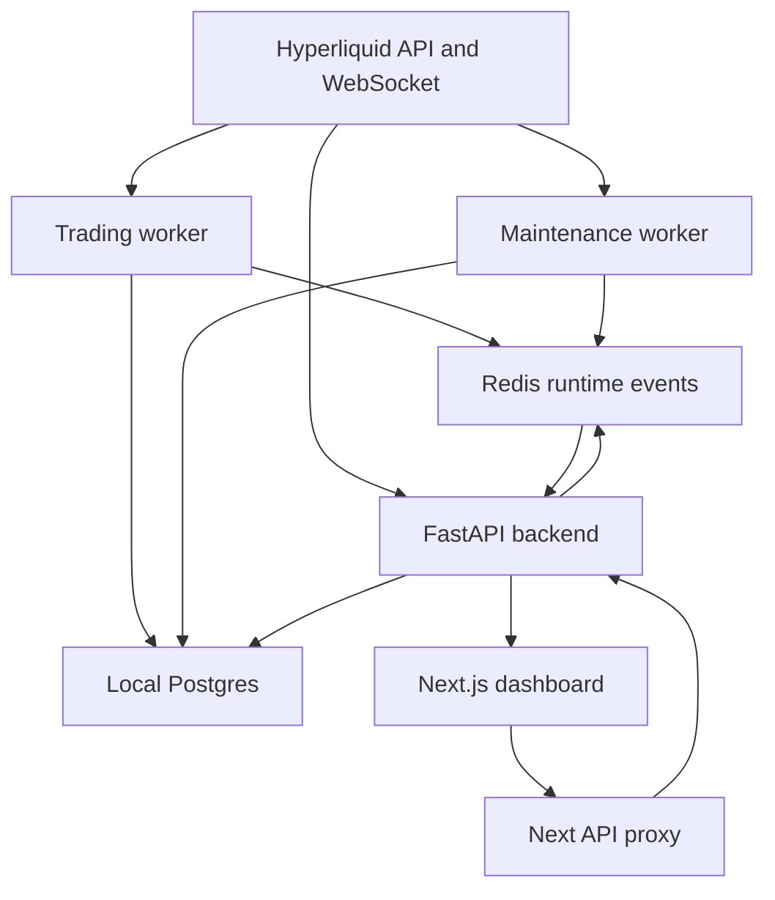
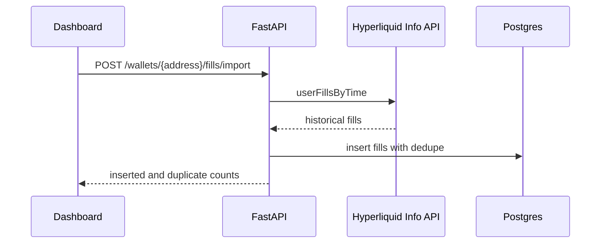
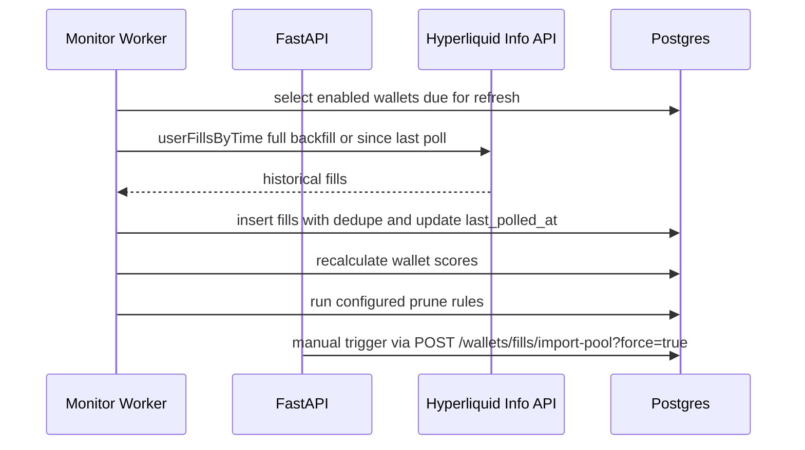
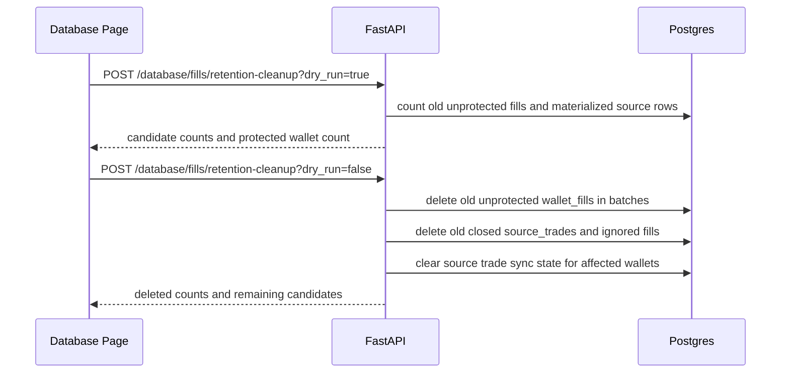
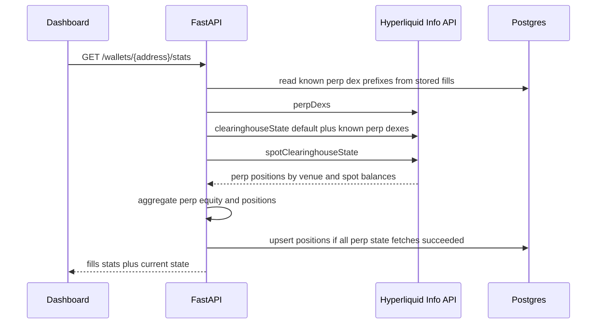
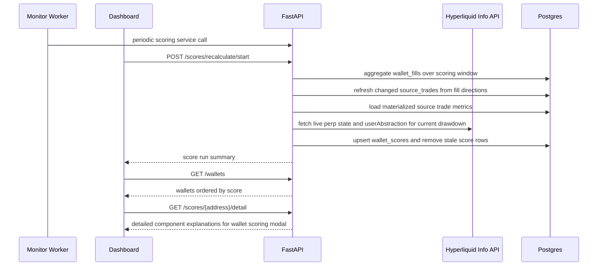
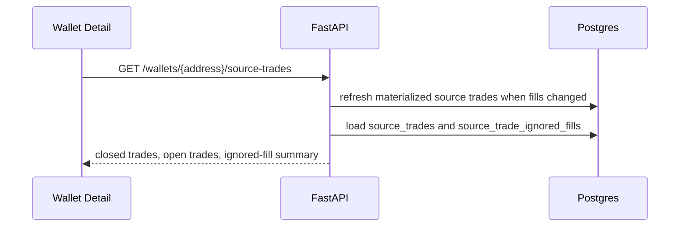
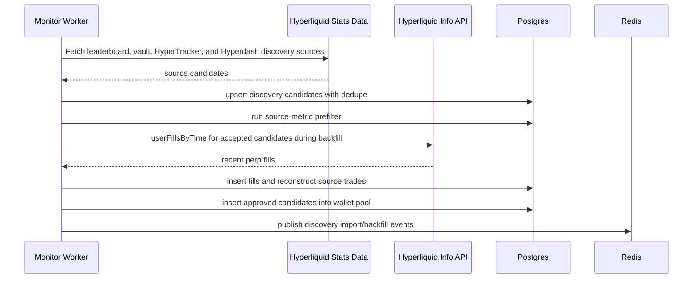
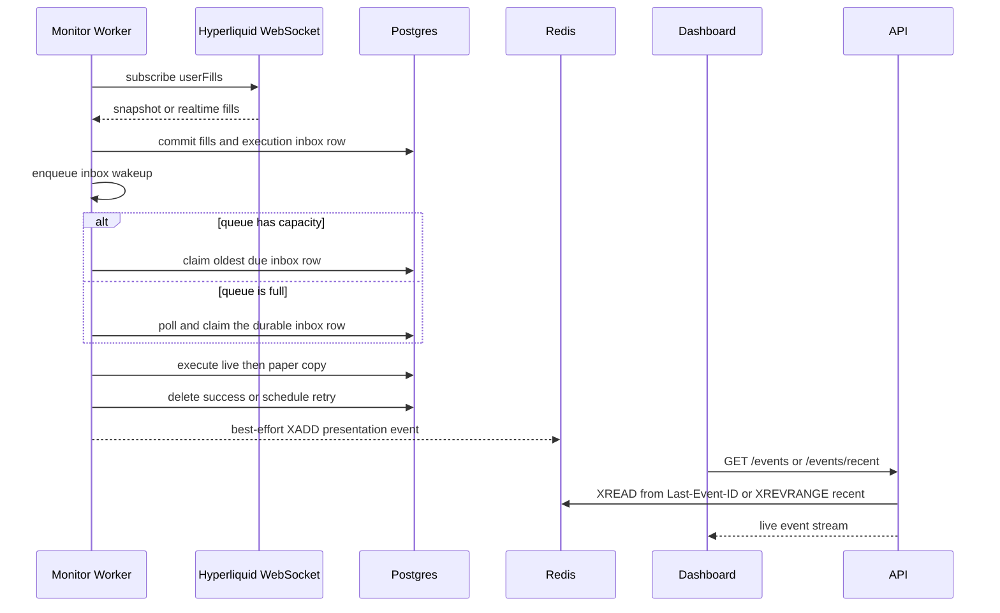
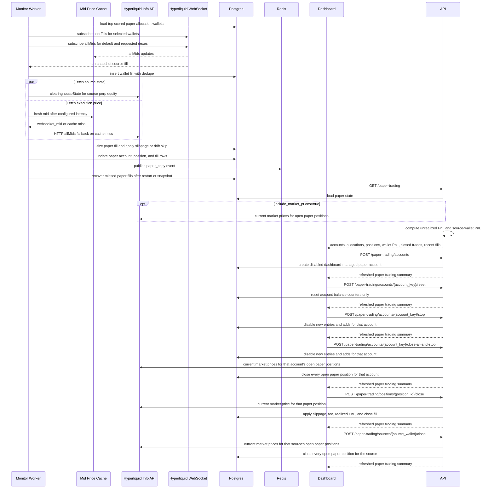

# Architecture

The system is split into a FastAPI backend, reusable Python worker loops, a
Next.js dashboard, local Postgres as source of truth, and Redis for runtime
events/cache.



## Root Structure

```text
copytrading-agent/
  backend/
    app/
      api/
      core/
      db/
      integrations/
      schemas/
      services/
      workers/
    config/
      app.json
      discovery.json
      live_trading.json
      paper_trading.json
      pool_fill_import.json
      prune.json
      scoring.json
      trading.json
  frontend/
    src/
      app/
      components/
      lib/
      types/
    config/
      app.json
  docs/
  infra/
  docker-compose.yml
  .env
```

## Backend

The backend exposes the API used by the dashboard and workers.

Current responsibilities:

- Health checks.
- Wallet CRUD.
- Manual discovery import trigger.
- Historical fill import.
- Fill listing.
- Paper trading summary.
- Live-ready generic trading account registry.
- Realtime event streaming through Server-Sent Events.
- Redis and Postgres integration.
- Dashboard Basic Auth for every route except `/health` and `/ready`.
- Database-backed job locks for discovery, pool import, scoring, and pruning.

Important folders:

- `backend/app/api`: FastAPI routes.
- `backend/app/services`: business logic.
- `backend/app/integrations`: external clients for Hyperliquid and Redis.
- `backend/app/db`: SQLAlchemy models, sessions, and Alembic migrations.
- `backend/config/app.json`: non-secret app/runtime settings.
- `backend/config/discovery.json`: discovery source, filter, backfill, and promotion settings.
- `backend/config/live_trading.json`: live trading enablement and guardrails.
- `backend/config/trading.json`: shared paper and live copy policy.
- `backend/config/paper_trading.json`: paper copy simulation settings.
- `backend/config/pool_fill_import.json`: pool reimport and shared fill import settings.
- `backend/config/prune.json`: wallet cleanup and pruning thresholds.
- `backend/config/scoring.json`: scoring windows, weights, and penalty settings.

## Worker

The monitor worker supports explicit roles through `WORKER_ROLE`:

- `all`: starts both trading and maintenance loops in one process.
- `trading`: starts realtime subscriptions, copy execution, copy recovery, and
  live reconciliation.
- `maintenance`: starts discovery, pool reimport, scoring, and pruning only.

Docker Compose runs `trading-worker` and `maintenance-worker` as separate
services and sets `WORKER_RUN_IN_API_PROCESS=false` on the backend container.
Before starting loops, each runtime acquires renewable capability leases in
`job_locks`. The keys are `worker_runtime:trading` and
`worker_runtime:maintenance`; an `all` worker must own both. Lease renewal is
fail-closed. Renewal calls have a deadline shorter than the TTL. A renewal
timeout or lost owner sets the shared stop signal before canceling the runtime,
so intake, heartbeat, and all supervised loops stop before lease release.
After a container replacement, the new process waits and retries in-process when
the previous lease has not expired yet. This avoids restart loops and stacktraces
during normal handover. Compose gives worker containers a 40 second stop grace
period so the configured 30 second drain can release leases and durable claims
before forced termination.

Every long-running loop is registered with a named supervisor. Unexpected loop
exit updates runtime state, records the error, waits for the configured restart
delay, and restarts it. Workers update heartbeat rows in `settings` with a stable
process instance id, owned capabilities, per-loop state, restart counts, latest
progress, and realtime queue depth, capacity, and drop count. Ops derives worker
health from both heartbeat freshness and the actual loop payload.

Long-running maintenance jobs still take job-specific rows in `job_locks`, so
manual API triggers and workers do not run the same operation concurrently.
Active jobs renew their TTL. A failed scoring stage reports failure to its caller,
and score-dependent prune does not run after that failure.
Long-running operation status is also stored in `settings`. Status writes use a
short transaction with an advisory lock and row-level locking so progress
updates do not overwrite each other when API and worker activity overlap.

Trading worker responsibilities:

- Refresh paper allocations and select up to `max_realtime_wallets` wallets from
  that same allocation result. When live trading is enabled, source wallets with
  open live source-attributed positions or unresolved exit lifecycle rows are
  retained first, then remaining slots are filled by the highest scored eligible
  copy candidates. Paper-only open exposure stays in allocation recovery but
  does not consume a live realtime slot. Paper-only mode retains open
  paper-position sources first.
- Check the desired realtime subscription list every
  `realtime_subscription_refresh_seconds`; keep the current WebSocket open when
  the list is unchanged and reconnect only when selected wallets change.
- A desired slot and actual monitoring are separate states. `hasRealtimeSlot`
  means the allocator selected the source. `isRealtimeMonitored` and
  `monitorStatus = "monitored"` are emitted only after Hyperliquid acknowledges
  that wallet's `userFills` subscription. Assigned sources are `connecting`
  until acknowledged and `offline` when the realtime loop has no current
  connection. A top candidate without a free slot is `waiting` with
  `sourceStatus = "waiting_for_slot"`. With live trading enabled, an
  outside-top-10 source retains slot intent only for open live exposure.
- The realtime loop persists connection state on transitions and every
  subscription refresh. State older than three refresh intervals is treated as
  disconnected. If every requested wallet is not acknowledged within one
  refresh interval, the worker reconnects instead of leaving the set in an
  indefinite connecting state. The worker writes `wallet_monitoring_stats`
  snapshots in the same transaction as subscription state changes and only for
  acknowledged wallets, so waiting time and downtime do not count as monitored
  time.
- Subscribe to Hyperliquid `userFills` over WebSocket.
- Subscribe to Hyperliquid `allMids` over WebSocket and maintain a short-lived
  price cache for copy execution.
- Store snapshot and realtime fills in Postgres.
- Persist every valid non-snapshot WebSocket fill in the durable execution
  payload even when the same wallet fill was inserted first by polling. The
  database inserted and duplicate counts stay accurate, while copy execution
  remains idempotent through the account and source-fill order key.
- Place committed paper execution payloads on a bounded realtime inbox wakeup
  queue. Place live source fills on a separate bounded wakeup queue backed by
  `live_copy_work`. If either queue is full, the durable database row remains
  claimable without Redis or the in-process wakeup.
- Both execution consumers claim durable Postgres work before an idle wait and
  poll again every five seconds when no local wakeup arrives. Local queue items
  wake the consumers immediately, while the bounded poll recovers from worker
  restarts and lost wakeups.
- Simulate paper copies for non-snapshot fills from scored allocation wallets.
- Submit live copy orders for non-snapshot fills when live trading and live copy
  execution are enabled.
- Run copy recovery on startup, snapshots, and the configured periodic recovery
  interval. Overlapping snapshot recovery attempts defer quietly while the
  account or global recovery lock is already owned.
- Live-copy recovery is lifecycle-aware. It establishes one baseline per live
  account/source pair, claims one durable state per planned source-fill part,
  and processes only due candidates that are newer than the baseline or overlap
  an owned source position. Baseline IDs and same-timestamp arrivals only scope
  recovery candidates, not entry permission. Completed dispositions are filtered
  before the query limit, so a historical prefix cannot starve new fills.
- Reconcile enabled live accounts when live trading reconciliation is enabled.
  Accounts already executing or reconciling are reported as deferred, not
  failed, and are retried by the next interval.
- Recover pending or uncertain live order outbox rows and resume unfinished
  live close-all operations before normal account reconciliation.
- Publish presentation events to Redis Streams through a best-effort boundary.
  Raw fill, result, and error events are published after the corresponding
  durable paper or live execution path. Redis failure never fails fill
  persistence or trading work, and Redis latency cannot delay an entry decision
  or block the next durable item without bound.
- Claim durable realtime execution payloads from Postgres. The local bounded
  queue only wakes the consumer and can be rebuilt after any restart.

Maintenance worker responsibilities:

- Run configured discovery imports every 6 hours by default.
- Import candidates from Hyperliquid leaderboard, HyperTracker segment,
  HyperTracker leaderboard, and Hyperdash discovery sources.
- Prefilter source candidates and store discovery run history.
- Backfill approved discovery candidates before they enter the pool.
- Insert candidates that pass backfill quality checks directly into the wallet pool.
- Backfill or incrementally refresh all enabled pool wallets in batches.
- Recalculate scores and run configured prune rules.

The paper allocation refresh is the source of truth for monitored wallets,
dashboard allocation state, and realtime subscription slots. Live-enabled
deployments use a live-first priority: open live source exposure first, then the
current highest scored eligible copy candidates. Paper-only open exposure stays
eligible for historical fill import and periodic paper recovery, but it does not
displace a live candidate or appear in Live Copy Sources. Paper-only deployments
retain open paper-position sources first. A new top candidate waits only when
open live exposure or higher-ranked candidates occupy every slot.

## Frontend

The dashboard is a Next.js app.

The application shell groups navigation into Execution, Intelligence, and
System areas. Desktop uses a persistent compact sidebar, while narrow screens
use the same routes in a horizontally scrollable navigation row. Page headers
contain only page identity, global freshness, and high-level state. Workflow
controls stay inside the relevant page surface. The Accounts page, for example,
keeps account selection and lifecycle actions in a dedicated control bar.

The UI foundation is defined by semantic Tailwind tokens and shared component
classes in `frontend/tailwind.config.ts` and `frontend/src/app/globals.css`.
`DashboardSurface.tsx` owns the common dashboard metric and panel primitives.
Color is not used as the only state signal: status pills include text and a
state dot, numeric tables use tabular figures, and all data tables have scoped
column headers and horizontal overflow containers. Shared loading, not-found,
and recoverable route error states cover navigation and API failures.

Current pages:

- `/`: overview and system status.
- `/wallets`: wallet pool management.
- `/wallets/[address]`: wallet details and recent fills.
- `/live-feed`: realtime system and fill events.
- `/analytics`: pool, scoring, paper, discovery, and freshness analytics.
- `/accounts`: selected paper or live account metrics, reconciliation, routing,
  positions, closed trades where available, and fills.
- `/trading`: execution cockpit, trading accounts, copy sources, combined paper
  and live positions, and combined execution activity.

Important folders:

- `frontend/src/app`: routes.
- `frontend/src/components`: reusable UI components.
- `frontend/src/lib`: API and config helpers.
- `frontend/src/types`: shared TypeScript types.
- `frontend/config/app.json`: non-secret frontend settings.

The dashboard enforces Basic Auth in Next.js middleware before serving pages or
`/api/backend` proxy routes. Server-side dashboard requests call
`serverApiBaseUrl` with a Basic Auth header from `DASHBOARD_AUTH_USERNAME` and
`DASHBOARD_AUTH_PASSWORD`. Browser requests use `/api/backend`, a Next.js proxy
route that attaches the same backend auth on the server side and streams SSE
responses without buffering.

Server-rendered dashboard data fetches use `serverApiTimeoutMs` from
`frontend/config/app.json`, defaulting to 15000 ms, so slow backend endpoints
cannot block page navigation for minutes. Fetches slower than 2000 ms are
logged by the frontend container for diagnosis.

The Analytics page reads `GET /analytics`. The endpoint intentionally returns
pre-aggregated rows so the dashboard can render pool coverage, score buckets,
opportunity and risk wallet lists, 30D source and coin performance, paper skip
analysis, discovery funnel quality, and freshness checks without issuing many
browser-side API requests.

## Data Stores

### Postgres

Postgres is the source of truth.

It stores wallets, fills, positions, scores, active copy set state, copy signals,
copy trades, risk events, settings, job locks, and audit logs.

Trading accounts carry lifecycle version, status change time, reason, and
optional archive time. Financial and idempotency
children use account key and account type foreign keys with restricted deletion,
so archive retains the execution ledger.

`wallet_fills` is the largest table. It is optimized as an append-heavy fact
table: rows have a real UUID primary key, dedupe is enforced by wallet address
and non-null external fill ID, and timestamp indexes support wallet detail,
scoring, stats, and source trade reconstruction queries. Raw fill payload
storage is limited to configured fields needed for later signal classification.
By default, historical and realtime fill ingestion stores perp fills only.
Historical import counts `targetFills` after this filter, so a 10k target means
up to 10k stored perp fills even when raw Hyperliquid pages also contain spot
fills.
The Database page also exposes per-index storage and usage stats from Postgres,
so index cost can be reviewed before changing schema. Dashboard stats use a fast
fill summary by default, based on Postgres table estimates, source trade sync
state, and materialized source trades. Use `GET /database/stats?exact_fill_stats=true`
only when an exact `wallet_fills` scan is needed for diagnostics. Manual fill
retention cleanup deletes old unprotected `wallet_fills`, old closed
`source_trades`, and old `source_trade_ignored_fills` in batches. It protects
active, realtime-slot, copy-enabled, active-allocation, open source-position,
open paper-position, open live-position, in-flight-order, and top scored
wallets. Deleted space becomes reusable after vacuum, but total database file
size may not shrink immediately on managed Postgres.
The Database page also has ignored-fill cleanup. It deletes raw fills that were
classified as pre-existing-position adds or close-only fills and are not needed
for reconstructed source trades. Unmatched close fills are kept when they line up
with a materialized source-trade close, so source trades can still be rebuilt
from retained raw fills.

Wallet deletion, pruning, and retention share one explicit dependency and
protection policy. Wallet-owned research and materialization rows are deleted
in dependency order. Discovery candidates and completed paper or live execution
records are classified separately and retained. Every destructive path checks
protection again immediately before mutation, and direct wallet deletion returns
`409` while a protection remains. The database also enforces copy signal, copy
trade link, and trading fill order relationships with foreign keys. Invalid
legacy references are repaired by the migration before the constraints are
created.

### Redis

Redis is presentation runtime state only. It is not an execution queue or a
trading source of truth.

Redis event delivery is best effort and may be delayed or unavailable, so it
cannot determine whether durable trading work is claimed or processed. Postgres
owns execution work, ordering, leases, and recovery instead.

It is used for:

- A bounded Redis Stream, `events:stream:v1`, for recent versioned events.
- Server-Sent Events replay through the Redis stream id and `Last-Event-ID`.
- Pub/sub compatibility channels for connected runtime consumers.

Worker publication has a timeout and catches Redis failures. Presentation events
can be delayed or omitted while Redis is unavailable, but committed fills,
execution, reconciliation, and recovery continue. The legacy `events:recent`
list is read only as a compatibility fallback when the stream is empty.
`/health` and `/ready` report Redis as degraded but remain HTTP-ready while
Postgres is healthy. Redis is therefore not a Compose startup dependency for
the backend or workers.

Redis can be rebuilt from Postgres and Hyperliquid history. The stream is capped
to recent events and is not an audit ledger.

Job locks are stored in Postgres, not Redis, so duplicate prevention survives
Redis restarts and shares the same transactional dependency as wallet data.

## Config Model

Tweakable non-secret config lives in backend and frontend config files:

- `backend/config/app.json`
- `backend/config/backup.env`
- `backend/config/database.json`
- `backend/config/discovery.json`
- `backend/config/live_trading.json`
- `backend/config/paper_trading.json`
- `backend/config/pool_fill_import.json`
- `backend/config/prune.json`
- `backend/config/scoring.json`
- `backend/config/trading.json`
- `frontend/config/app.json`

The backend config files are grouped by operational area:

- `app.json` owns non-secret runtime defaults such as worker mode, capability
  lease TTL, supervisor restart delay, shutdown drain window, realtime wakeup
  queue size, inbox claim timeout, retry backoff, Ops and backup status
  monitoring, dashboard auth enablement, wallet pool page limit, network, and
  shared infrastructure settings.
- `backup.env` owns the automated Postgres backup interval and retention.
- `discovery.json` owns source discovery, candidate filtering, backfill quality
  checks, and promotion.
- `database.json` owns manual database maintenance defaults such as fill
  retention days, retention batch size, max rows, and protected top scored
  wallets.
- `live_trading.json` owns live execution guardrails, entry intent TTL,
  reconciliation freshness, min-order wire buffer, weekly account-loss
  percentage, order rate, and reduce-only behavior.
- `trading.json` owns copy policy shared by paper and live copy, including
  source ranking limits, allocation pockets, minimum copy notional, optional
  min-order adjustment, price drift guard, and live mid-price cache settings.
- `paper_trading.json` owns paper-only simulation settings such as simulated
  fees, simulated slippage, simulated latency, and recovery cadence.
- `pool_fill_import.json` owns scheduled pool reimport and shared fill import
  storage and market-filter settings.
- `scoring.json` owns scoring schedule, score windows, weights, ratio spans,
  thresholds, and penalties.

Secrets, connection strings, deployment identity, and the single live trading
activation switch live in `.env`:

- `POSTGRES_DB`
- `POSTGRES_USER`
- `POSTGRES_PASSWORD`
- `DATABASE_URL`
- `DATABASE_URL_DIRECT`
- `REDIS_URL`
- Hyperliquid private key and wallet address
- `LIVE_TRADING_ENABLED`
- dashboard auth credentials
- VPS dashboard host value used by Caddy

Docker Compose builds `DATABASE_URL` and `DATABASE_URL_DIRECT` for app
containers from `POSTGRES_*` and the local `postgres` service. Direct database
URLs remain available for non-Compose runs and external Postgres migrations.
Docker Compose injects only process-specific wiring such as `APP_ENV`,
`WORKER_ROLE`, `SERVER_API_BASE_URL`, and database service URLs. Normal
non-secret settings belong in the config files and must not be duplicated in
`.env`.

Repository defaults use mainnet market data and keep live trading and automatic
live copy disabled. `LIVE_TRADING_ENABLED=true` is the only global execution
switch. The live adapter's market-policy function currently permits every market
supported by Hyperliquid metadata.

The Phase 6 migration chain preserves financial children, reconstructs only unambiguous
missing account parents as disabled archived placeholders, and stops for manual
review on account-type conflicts or unsafe duplicate live routes. After upgrade,
restart both worker roles and the backend. Migration `a7d3e9f1c5b2` removes the
obsolete global entry-control table.

Wallet fill timestamps and ingest latency use `BIGINT`. This allows historical
snapshot fills to retain their full source-to-ingest age without overflowing a
32-bit millisecond counter.

## Deployment Security Boundary

The browser reaches the backend through the same-origin Next.js proxy. The proxy
reconstructs the public request origin from Caddy's trusted
`X-Forwarded-Host` and `X-Forwarded-Proto` headers, rejects cross-origin
mutation requests before forwarding them, replaces client authorization with
server-side Basic Auth, and sets the upstream origin to the backend origin. The
VPS Compose file exposes only Caddy, so browsers cannot bypass this trusted
proxy boundary and reach the frontend container directly. The backend
independently validates `Origin` for authenticated `POST`, `PUT`, `PATCH`, and
`DELETE` requests against same-origin and configured CORS origins. These paired
origin checks form the CSRF boundary for browser mutations. Command-line clients
without an `Origin` header still authenticate through Basic Auth.

Backend and frontend images run as non-root users. Compose applies read-only root
filesystems, explicit writable `tmpfs` mounts, `no-new-privileges`, and drops all
Linux capabilities for application containers. Redis has its own healthcheck
but does not gate backend or worker startup. Caddy applies HSTS on the VPS and
content-type, frame, referrer, and permissions headers at the edge.

## Test Architecture

Fast unit tests run without external services. Tests marked `integration` use
the disposable Postgres and Redis services in `docker-compose.test.yml`. The
integration path migrates an empty database to Alembic head, checks the database
schema and revision, exercises real dependency health and wallet API requests,
and runs failure-oriented live trading and cleanup characterization tests.
Known defects assigned to later phases are strict expected failures. They must
be converted to normal regression tests when the owning implementation phase is
completed. Frontend tests use Vitest, jsdom, and Testing Library. GitHub Actions
runs both suites plus lint, compile, typecheck, and production build checks.

Docker Compose also runs `postgres-backup`, a lightweight Postgres container
that executes `pg_dump` immediately at startup and then every 24 hours by
default. Dumps are written to `backups/postgres`, and `/ops` reads that mounted
directory for backup freshness.

## Data Flows

### Historical Fill Import



### Pool Fill Import



The maintenance worker runs the pool maintenance cycle every 30 minutes by
default. A cycle imports all due pool wallets across configured batches,
recalculates wallet scores, and then runs sharp pruning when
`wallet_prune_worker_dry_run` is `false`. Manual pool reimport forces a refresh
regardless of `last_polled_at` and still deduplicates overlapping fills.

### Fill Retention Cleanup



Retention cleanup is manual and uses a database-backed job lock. The default
retention window is 90 days, matching the default pool import and candidate
backfill windows. The default scoring window stays 60 days. Source trade sync
state is cleared for affected wallets so the next scoring run or wallet detail
request rebuilds source trades from retained fills.
Ignored-fill cleanup is a separate manual action. It has its own job lock, runs
as dry-run by default, and only deletes raw ignored fills that are not required
for source-trade reconstruction.

### Wallet Current State



Wallet detail pages show current unrealized drawdown from live perp state.
Score realized drawdown comes from reconstructed closed trades and does not
include intratrade open unrealized PnL.

### Wallet Scoring



Risk score combines realized reconstructed-trade risk with current open perp
drawdown and margin stress when `scoring_current_drawdown_enabled` is true.
Current drawdown is stored as `wallet_scores.current_drawdown_pct` with
`wallet_scores.current_drawdown_status`. Margin stress is stored as
`wallet_scores.open_position_stress_pct` and is calculated from live unrealized
loss, margin usage, and notional exposure. Unified wallets use unified USDC from
`spotClearinghouseState` as account value; standard wallets use perps account
value. Live current drawdown can consume the full risk component, and severe
current drawdown also caps the final score. This prevents wallets with perfect
realized win rates from ranking highly while they carry large unrealized losses.
If live state is incomplete or account value is zero, the scoring run keeps the
history-only risk component and applies the configured missing-state penalty.
Scoring only checks default perp plus dexes already observed in stored fills, so
full HIP-3 discovery remains limited to single-wallet current-state views.
By default, current drawdown risk penalty starts at 5 percent and reaches full
penalty at 75 percent. The final score cap starts at 25 percent current drawdown
and reaches zero at 100 percent.
Consistency score measures repeatability and evenness, not profitability or win
rate. It uses profit distribution, largest-win dependency, closed-trade ROI
stability, downside ROI stability, active-day regularity, and max inactive gap.
Profit distribution is calculated from winning closed trades as effective
winning trades, `1 / sum(profit_share^2)`, divided by the number of winning
trades. Win rate and profit factor remain reference stats outside the
consistency component.
Profitability score is scale-invariant. It combines total net ROI against
reconstructed entry notional, capped average trade ROI, and median trade ROI.
The weights are 55/30/15, and each ROI subscore maps 0% or lower to 0 and +3%
to 100. Current-equity return is exposed in the detail modal as reference data
only because deposits and withdrawals can distort it. Absolute net PnL is also
reference data only and does not raise the profitability score.
Recency score uses the latest non-liquidation trading fill in the scoring
window, not only the latest closed reconstructed source trade. Open, add,
reduce, close, and flip fills count as activity, while liquidation fills are
excluded so liquidation events do not create a positive freshness signal.
Risk loss-ratio, realized-drawdown, losing-rate, live drawdown, margin-stress,
and live score-cap thresholds are configurable. Copyability measures practical
followability through copyable trade ratio, median trade notional, p25 trade
notional, and execution simplicity. Trade count is intentionally excluded from
Copyability because sample size is handled by sample caps and the
low-confidence penalty. Penalty caps for low sample, stale trading, negative
PnL, open-only activity, confidence, and missing live state are configurable.
Ignored fills are kept as diagnostic reconstruction metadata and do not reduce
wallet score.
Forced exits are scored inside Risk and Copyability, not as a separate
final-score penalty. Risk includes forced-exit severity, which compares
liquidation-tagged close notional with reconstructed entry notional. Copyability
includes forced-exit fill ratio, which compares liquidation-tagged reconstructed
close fills with total reconstructed close fills. Profitable forced exits still
count as these signals because exact liquidation behavior is difficult to copy.
Materialized `source_trades` rows store liquidation flags, liquidation fill
count, and liquidation notional so wallet source trade history can tag affected
closed trades.
Wallet detail pages use `GET /scores/{address}/detail` for the Detailed scoring
modal. The endpoint recalculates the current wallet score from the same
materialized trade metrics, then returns gross score, penalty, final score
before caps, live risk score cap, sample cap, component weights, weighted
scores, and input-level explanations for each scoring part. The modal is
explanatory only and does not write scoring data.
Wallet list and wallet detail responses expose `poolRank`, which is calculated
from the latest stored wallet score ordering and is independent of realtime
monitor slots.
The scoring job lock uses a 30 minute TTL and renews while scoring is active, so
a killed scoring process does not block future runs and a healthy long scoring
run does not expire mid-run.

### Source Trade Detail



### Discovery Pool Admission



### Wallet Pool Pruning

- `POST /wallets/prune-all` is the dashboard-facing pruning entrypoint.
- Orphan-fill pruning removes stored fill data whose wallet address is no longer
  present in `watched_wallets`.
- Zero-fill pruning removes polled wallets that have no stored fill rows at all;
  this replaces the older non-perp cleanup in normal UI workflows.
- Stale-fill pruning removes polled wallets with stored fills when their latest
  fill is at least the configured inactivity window old. The default is 30 days.
  It requires a poll after that inactivity window elapsed, so stale cleanup does
  not delete wallets solely because their local import state is old.
- Realized drawdown pruning uses stored reconstructed closed-trade scores and
  removes non-active, non-copy wallets at or above the configured drawdown
  threshold.
- Low-score pruning removes polled, scored wallets whose reconstructed closed
  trade count is at least the configured minimum and whose final score matches
  the configured cutoff in `backend/config/prune.json`.
- Current drawdown is not part of `POST /wallets/prune-all`. It is handled by
  wallet scoring and paper allocation filters during normal operation. The
  standalone `POST /wallets/prune-current-drawdown` endpoint remains available
  for isolated maintenance.
- All pruning rules use the shared protection policy. Sources with active copy
  state, active paper allocations, open source, paper, or live positions,
  legacy open copy trades, or non-terminal trading orders are excluded. Orphan
  fill pruning applies the same policy even if the `watched_wallets` row is
  missing.
- Protection is rechecked immediately before delete. Only addresses actually
  deleted are added to the discovery ignore list.
- Cleanup removes all rows classified as wallet-owned, including monitoring,
  source-trade sync, ignored-fill, score snapshot, and inactive allocation rows.
  Discovery candidates and completed execution history are preserved.
- Pruned wallets are also added to the discovery ignore list so scheduled imports
  do not immediately re-add the same address.

### Realtime Monitoring



### Paper Copy Simulation



Paper sizing uses `source fill notional / source perp equity` and applies that
exposure inside each configured source-wallet pocket. Default pockets are 25% for
each top 10 rank, with an 80% total open copied-margin cap per paper account.
Valid source perp equity is required for opens and adds only. Reduce, close, and
flip-close parts are processed against existing paper positions even when the
current Hyperliquid source state reports zero or unavailable perp equity after
the source has exited. If a source wallet reports zero per-dex perp equity and
Hyperliquid `userAbstraction` reports a unified account, source sizing uses
unified USDC from `spotClearinghouseState`.
When current drawdown scoring is enabled, paper allocation only selects top
score wallets whose latest `wallet_scores.current_drawdown_status` is `ok`.
The trading worker reads source per-coin leverage from Hyperliquid `clearinghouseState`
and uses `notional / leverage` for margin accounting. If leverage is unavailable
for a coin, paper falls back to 1x. When live mids are enabled, a WebSocket
`allMids` cache is used first. HTTP `allMids`, dex-specific `allMids`, and then
`metaAndAssetCtxs` are used as fallbacks for stale or missing cached prices.
When a `dex:COIN` fill misses cache, the worker requests a matching dex-specific
WebSocket `allMids` subscription so later fills can use cached prices.
For isolated HIP-3 positions, Hyperliquid `marginSummary.accountValue` can equal
isolated position equity and move with `totalMarginUsed`, so it should not be
read as a stable wallet cash balance.
Opens or adds below the configured minimum notional are adjusted up to the
minimum when `trading_copy_adjust_small_orders_to_min_order` is enabled and the
source and account caps can fit the adjusted margin. Otherwise they are skipped
before any paper position is created. The default minimum is 10 USD to match
Hyperliquid's live perp minimum order value. Paper execution starts the
configured latency while source account state is fetched in parallel, then
prices from live mids when enabled, applies adverse slippage, and skips fills
whose adverse observed drift exceeds the configured max drift limit. Favorable
price drift is allowed and recorded as 0 bps. Live reduce-only exits bypass the
entry drift guard so price movement cannot strand copied exposure. New open or
add fills are admitted only when their durable first observation is within
`trading_copy_max_entry_age_seconds` of the source timestamp, so snapshot or
recovery entries cannot open exposure minutes after the source traded. The
immutable observation timestamp keeps internal queue, preflight, and retry time
from turning a promptly received entry stale. Live copy stores stale-entry
decisions in the per-fill lifecycle ledger and links a `TradingOrder` only when
the result is a terminal order-level decision. Each pre-submit decision stores
its decision time and exact reason, including source or total allocation
exhaustion, reconciliation state, source account state, and submit validation
failures.

Live-copy scheduling uses `live_copy_work` as the single durable ownership
boundary for realtime and recovery. Realtime ingestion inserts one unique work
row in the same transaction as a newly stored source fill. Startup, snapshot,
and periodic recovery only enqueue missing candidate fills into the same table.
They do not call live execution through an independent path. Claims are
committed before Hyperliquid I/O, canonical source ordering is stored with each
work item, and transient failures return the item to a durable retry schedule.
The pre-barrier terminalization pass only claims entry parts whose source fill
is already stale. Fresh entries remain unclaimed until the normal execution
pass, which gives each fresh part one lifecycle claim and prevents a self-owned
`processing` lease from blocking that same work item.

The execution path does not run full account reconciliation before evaluating a
fresh entry. It consumes the latest authoritative reconciliation snapshot and
lets the dedicated reconciliation loop refresh exchange state. Entry submission
still enforces reconciliation completeness and maximum snapshot age, and it
enforces the entry-intent TTL from actual local intent construction to exchange
submission. A retryable order retains its original construction time instead of
renewing the TTL on each retry.
Before a `TradingOrder` exists, the same configured TTL bounds preparation from
the entry part's immutable first processing claim. An unresolved entry becomes
the terminal no-order decision `live_entry_preparation_expired`; reduce and
close parts are not expired by this pre-intent deadline. Once an order exists,
its original `created_at` and the normal intent-expiry path remain authoritative.
An exit from a source without an attributed position is ignored without retry
when another source currently owns that market. Truly incomplete or conflicting
lifecycle proof remains retryable and never creates an order until ownership is
proven.
The renewable `live_execution:{account_key}` fence is shared by order
submission, reconciliation, and margin-setting synchronization. A busy fence is
a transient coordination result, not evidence of another visible fill. A fully
validated entry that cannot submit because the fence is busy is persisted as
`skip:live_execution_busy` with its complete pre-dispatch intent. Retry reuses
the original logical order ID, size, notional, leverage, margin mode,
limit price, and creation time without requiring a fresh source leverage read,
then rechecks current price drift and the normal account, lifecycle,
reconciliation, risk, and capacity gates. The original TTL is never renewed;
expiry becomes `live_entry_intent_expired`.
`LiveCopyFillState` stores explicit execution-claim, processing-start, and
decision timestamps. These are Python wall-clock values and are not derived
from PostgreSQL transaction-scoped `now()` values.

Paper fees use
Hyperliquid's base perp taker fee by default, 0.045%, because paper execution
models immediate taker-style fills rather than resting maker orders.
Stored paper position notional and margin represent simulated entry exposure.
Adds increase stored margin by the new fill margin, and partial closes reduce
stored margin proportionally. Current notional is calculated separately from mark
price for live unrealized PnL.
Open position summaries expose entry execution delay as `created_at - opened_at`,
where `opened_at` is the source fill timestamp and `created_at` is when the
paper position row was created. Live open position summaries expose the same
source-to-open delay by matching stored live open fills back to the copied
source wallet fill timestamp. Exchange aggregate live position rows reuse the
matching source-position delay when available and the dashboard labels that
aggregate-row value as source-to-exchange. Realtime live-copy execution runs
before paper-copy simulation so live orders do not wait for paper latency or
paper-only bookkeeping.
Live reconciliation anchors an exchange aggregate position to the earliest
matching copied source position. This prevents reconciliation from cutting off
valid fills in the current position lifecycle. Open-position add counts include
only actual `add` executions and exclude the initial open and a new position
created by a flip.
When multiple source fills have the same timestamp, paper-copy processing orders
close and flip-close fills first by descending source `startPosition` before
falling back to the fill id. This keeps large split exits deterministic.

Paper copy state is durable in Postgres. Trading worker restarts keep existing
`paper_positions` and `paper_copy_fills`, retain source wallets with open paper
positions in the copy allocation set, and run recovery after worker start,
WebSocket snapshots, and the configured periodic recovery interval. Recovery
focuses on sources with open paper positions and current monitored allocation
sources instead of scanning every historical paper-fill source. For open
entries, recovery obeys the same max entry age guard as realtime copy. For close
and reduce fills, recovery can still catch up older source exits. For
open-exposure sources, recovery scans fills from the oldest open paper position
with overlap, then the copied-fill uniqueness constraint prevents duplicate
simulation.
- Live-copy recovery uses its per-account/source baseline and per-fill state
  ledger instead of rewinding from the oldest open live position. Completed
  dispositions are excluded before the recovery limit, while overlap for owned
  live positions keeps their exits recoverable. Stale entries become terminal
  decisions; unavailable source state or execution prerequisites use bounded
  retry state and do not create fake live order rows.
Paper-copy mutations also take a Postgres advisory transaction lock per source
wallet. That serializes realtime fill processing, recovery reconciliation, and
manual closes for the same source exposure.
Paper account rows are locked before copied fills are written, so different
source wallets cannot concurrently update the same paper account balance.
Successful paper fills also store a `raw_payload.tradeIntent` object from the
shared trading core. That intent contains side, action, size, notional, limit
price, reduce-only state, and deterministic client order id, so live execution
can consume the same planned order shape that paper simulation uses.
Allocation refresh also restores open paper-position sources into
`watched_wallets` as neutral `pool` rows if an earlier prune removed the pool
row.
Retained sources outside the current top 10 keep their allocation record only
for managing existing exposure. They can add to matching open paper positions
and can reduce or close them, but new entries are skipped with
`retained_source_new_position_blocked`.
The paper summary reports slot state separately from trade state. Allocation rows
use `monitorStatus` as `monitored`, `connecting`, `offline`, or `waiting`.
Wallet PnL history rows use `monitorStatus` as `monitored` or `history`.
`sourceStatus` is `trading`, `retained`, `entries_paused`,
`waiting_for_trades`, or `waiting_for_slot`. Confirmed WebSocket subscription
state is authoritative for the `monitored` label; accumulated monitoring
duration is historical performance data only. Live Copy Sources begins with
the worker's desired and confirmed wallet sets even when live-account entries
are paused, then supplements them with allocation and open-position sources.
Live source performance metadata aggregates realized PnL and fill count across
the complete source-attributed `trading_fills` ledger. The dashboard divides
that realized PnL by the same wallet's accumulated monitored seconds for the
displayed US$/h rate. It never combines live PnL with a paper-derived per-hour
rate. Copy Sources sorts by allocation-used percentage descending,
followed by used USD, realized PnL, status, pool rank, and wallet-address
tie-breakers. Wallet PnL History sorts by realized PnL descending, followed by
total PnL, pool rank, and wallet address.
Open-position rows sort by durable opening time ascending and use position
identity as a deterministic tie-breaker, so mark updates do not reorder them.
Dashboard source counters are reduced from the same current source rows as the
badges, so source-attributed open positions drive the trading count
even when exchange aggregate positions are preferred in the separate
open-position display.
The dashboard aggregates allocation status across paper accounts when rendering
source rows. Open source-attributed exposure is `trading` only when it has both
a current realtime slot and entry permission. Otherwise it is retained for
reductions and exits and rendered as `reduce only`. Entry readiness separately
determines whether an empty slotted source is `waiting_for_trades` or
`entries_paused`.
Paper account `enabled` is database runtime state after the account has been
created through the dashboard or API. The Accounts page can create paper
accounts with a selected USD starting balance and live accounts with a wallet
name, optional wallet address, and optional vault address. Empty wallet address
fields use and save `HYPERLIQUID_WALLET_ADDRESS`. Live account keys are
generated internally from the wallet route, so the display name can change
without creating a duplicate route. New accounts start disabled and reconcile
the exchange wallet snapshot immediately so equity, balance, and open live
positions are visible before trading is started. The live Reconciled card can
also manually refresh the selected live account snapshot. The Accounts page
adapts paper and live account sources into the same account view model, so the
same panels and row components render the selected account.
`AccountsDashboard.tsx` owns refresh, account selection, lifecycle actions, and
create-account orchestration. `accounts-dashboard/accountViewModel.ts` performs
the paper and live normalization. Focused components own performance analytics,
risk and exposure, portfolio breakdowns, activity tabs, diagnostics, and the
create-account dialog. `AccountTransactionsPanel.tsx` loads the selected live
account's full external cash-flow ledger independently from the four-second
account summary refresh. `AccountPerformanceChart.tsx` owns the interactive SVG
chart and closed-trade statistics. The Accounts page can change enabled state
for one account without disabling other accounts.
Disabled paper accounts are excluded from new entries and adds, but are still
included when an existing open position for the source needs a reduce or exit
fill. Live accounts use `enabled`, `exit_only`, and `disabled` status. The
close-all-and-stop route sets the selected account to exit-only first, closes
open positions for that account, and disables the account only after a fresh
exchange reconciliation confirms no exchange positions remain. Account deletion
removes local database state for the selected account. Paper deletion removes
paper positions, fills, allocations, and account history. Live deletion removes
local live account, order, fill, and position snapshots only, requires the
account to be stopped first, and does not close exchange positions.
The summary also exposes `poolRank` and `sourceStatusReason`. `poolRank` is the
source wallet's score rank in the wallet pool, while `sourceStatusReason`
explains why a source is retained or waiting without relying on monitor-slot
ordering. If a source is a valid copy candidate but a specific paper allocation
is inactive, retained allocation rows report `paper_account_disabled` only when
the paper account is disabled. Otherwise they report `allocation_inactive`.
After replay, recovery fetches the source wallet's live perp state. If an open
paper position no longer has a matching source coin and side, paper closes it at
the current simulated market price with normal fee and slippage. Coin matching
uses the same `dex:COIN` alias handling as market data, so HIP-3 prefixed fills
can match unprefixed live position keys.
The dashboard can also manually close an open paper position. Manual closes use
the same simulated current market price, adverse slippage, and fee model, then
persist a normal `close` fill in `paper_copy_fills` so account PnL and source
wallet history remain durable across restarts.
Copy source rows can also manually close all open paper positions for a selected
source wallet across paper accounts. The source-wide close uses the same manual
close execution model and fails without committing if any required execution
price is unavailable.

Paper copy fill rows store source wallet sizing context in
`paper_copy_fills.source_perp_equity_usd`. The API also exposes
`sourceAccountValueUsd` as a read alias for the same value. Current wallet
position snapshots store Hyperliquid `positionValue` in
`wallet_positions.position_value_usd`, while historical fill notional remains in
`wallet_fills.notional_usd`.

### Live-Ready Trading Core

The backend separates copied order planning from execution. The shared
`trading_core` module produces `TradeIntent` objects and shared sizing helpers.
Paper execution consumes those intents through the existing paper simulator.
Live execution has a separate Hyperliquid adapter. The trading worker executes
live copy only when global live trading, copy execution, and the selected live
account are enabled. It can also reconcile enabled live accounts when live
trading is enabled.

Generic live-ready tables sit beside the legacy paper tables:

- `trading_accounts`: paper and live account registry with status, network,
  wallet address, vault address, and account PnL fields.
- `trading_positions`: account/source/coin position state for live copy and
  reconciliation.
- `trading_orders`: idempotent order records keyed by deterministic client order
  id and source fill sequence.
- `trading_order_dispatches`: an append-only exchange-attempt ledger per live
  order, including an attempt-specific CLOID, exchange outcome, and
  uncertain-delivery status lookup diagnostics.
- `trading_close_all_operations`: resumable account-level close-all state.
- `trading_close_all_items`: per-position close progress linked to the latest
  durable live order.
- `trading_reconciliation_runs`: one auditable row per live reconciliation
  attempt with component statuses, counts, errors, and final completeness.
- `trading_fills`: reconciled exchange fill records.
- `trading_funding_payments`: signed Hyperliquid `userFunding` entries,
  deduplicated per live account and exchange event.
- `trading_account_cash_flows`: signed external capital movements imported from
  Hyperliquid `userNonFundingLedgerUpdates`. Deposits, withdrawals, and
  transfers to or from another account are included. Spot/perp and account-class
  transfers inside the same account are excluded. The account-scoped
  `GET /trading/accounts/{account_key}/cash-flows` endpoint returns the complete
  ordered ledger and aggregate deposit, withdrawal, and net-flow totals.
- `trading_account_performance_snapshots`: verified live equity snapshots with
  period cash flows, period return, cumulative trading PnL, and a chain-linked
  performance index.
- `live_copy_source_states`: one baseline and lifecycle marker per live account
  and source wallet. It records activation, the latest baseline timestamp and
  same-timestamp fill IDs, plus an observability high-water mark and compact
  unowned preexisting-market state. This is audit state, protected by
  `RESTRICT` foreign keys, and is not owned by wallet cleanup.
- `live_copy_fill_states`: one durable disposition per live account, source
  fill, and planned fill part. It records the immutable plan version and
  expected part count, processing origin, terminal or retryable outcome,
  attempt timing, and optional link to the `TradingOrder` created by a real
  order-level decision.

Live copy lifecycle and recovery use these tables as a separate state machine
from the raw fill and order ledgers:

- `WatchedWallet.copy_eligibility_started_at` is the global source-selection
  epoch. `LiveCopySourceState` is per live account/source and has its own
  `activated_at`. A normal entry requires both the immutable first observation
  to be at or after `activated_at` and the authoritative source timestamp to be
  at or after the activation time. Baseline IDs only scope recovery candidates;
  they never grant entry permission. Same-timestamp late arrivals can be
  candidates, but are not automatically eligible. A source selected for one
  account cannot keep a disabled account's lane active. Flat ineligible lanes
  become inactive, while nonzero owned positions and unresolved orders retain
  exit management. Start refreshes every eligible lane's baseline in the same
  transaction before entries are enabled.
- `LiveCopySourceState.entry_eligible` is the authoritative account/source
  entry-routing truth. Current selection sets it to true. Owned-only retention
  keeps the source state active with the flag false, and reselection sets it
  back to true only after a fresh baseline. Paper allocation activity is not an
  indirect substitute for this final live-entry decision.
- Activating an account/source pair captures the newest known `WalletFill`
  timestamp and every ID observed at that timestamp. Only a narrowly proven
  same-side owned continuation may cross a fresh retained baseline. A fresh
  post-baseline lifecycle still has to pass the normal entry gates.
- Each source fill is split into planned lifecycle parts, then claimed through
  `live_copy_fill_states` with one of the four recovery origins: `realtime`,
  `snapshot_recovery`, `startup_recovery`, or `periodic_recovery`. The state
  records `pending`, `retryable`, `order`, `terminal_skip`, or
  `baseline_ignored`, together with bounded backoff timing and attempt count.
  The complete immutable plan is committed before part zero may dispatch. A
  committed flip-close therefore always leaves its flip-open as a durable
  pending or terminal row after a worker crash. The final gate takes the
  account-scoped lifecycle lock before source-state and fill-state row locks,
  then commits before the exchange request.
- `WalletFill` remains the complete source audit truth. `TradingOrder` is linked
  only after a real live order or a terminal order-level decision exists. An
  unowned preexisting add, reduce, close, or flip-close is recorded as
  `baseline_ignored` and does not create a failed order row. A post-baseline
  flip-open starts a fresh lifecycle and can be copied only after the normal
  entry gates pass.
- The account API does not suppress `TradingOrder` history with payload flags.
  Existing failures and terminal decisions remain visible and auditable; the
  lifecycle fix prevents transient prerequisites from manufacturing new rows.
- Reconciliation, source state, source equity, leverage, margin mode, and
  execution-price prerequisites that are temporarily unavailable stay in the
  fill-state ledger with exponential backoff. Realtime inbox work remains
  pending for retry when that source event came through the inbox. These
  pre-order deferrals do not manufacture `TradingOrder` rows. Their separate
  pipeline decisions remain operationally visible, but are not called fills or
  orders when no `tradingOrderId` exists.
- An entry that exceeds the configured TTL is a terminal stale decision. It is
  distinct from a retryable prerequisite and retains both the original source
  timestamp and the decision timestamp. The API also exposes the processing
  origin, `observedAt`, and `firstObservedAt`. The dashboard derives ingest lag,
  total source-to-decision age, and processing lag from these timestamps, allowing
  ingest delay to be distinguished from processing delay. This terminal stale
  state creates no `TradingOrder`.
- Recovery filters completed dispositions before applying its limit, selects
  only due pending or retryable work, and retains nonzero owned positions plus
  unresolved orders, including filled orders whose exchange fills are not fully
  materialized. This overlap keeps old exits recoverable and removes fixed-
  prefix starvation while preserving exit management. Later non-stale fills
  behind an unfinished same-market predecessor are removed before `LIMIT`.
  Stale entries alone may bypass that query barrier so the prepass can record
  their terminal no-order decision.
- Processing is ordered per live account, source wallet, and coin using the
  canonical numeric source-fill key. Close and flip-close parts precede opens,
  and a pending or retryable earlier fill is a durable head-of-line barrier for
  later fills in the same market lane, including work arriving through a
  separate realtime inbox item. Independent coins are not blocked.
- Lifecycle mutations take one account-scoped PostgreSQL advisory transaction
  lock before source-state and fill-state row locks. Activity synchronization
  reads account/source keys first and then follows that same lock order, avoiding
  the previous row-lock to advisory-lock inversion.
- Legacy attribution and lifecycle keys bootstrap only from strict current
  executed-fill proof. Exchange and manual-test reserved sources are excluded;
  historical existence alone cannot create attribution or an active lane.
- Reconciliation can leave a valid aggregate exchange position while a copied
  source-attribution row is missing. A continuation add or close restores that
  attribution only if executed fills reconstruct the current market lifecycle,
  the reconstructed aggregate matches the exchange side and size, no competing
  source owns the market, and manual fills do not add unexplained exposure.
  Recovery restores at most the proven source size and defers ambiguous cases
  without submitting an order.
- A pending or retryable `reduce`, `close`, or `flip_close` is itself durable
  ownership work. It retains the account/source lane, watched-wallet record,
  realtime subscription priority, and recovery eligibility even if the source
  position or logical order row is temporarily absent.
- Reconciliation upgrades an exchange-attributed fill to its copied source only
  when the stored exchange order id or dispatch CLOID matches a durable logical
  order for the same account and market. Periodic reconciliation then runs strict
  attribution bootstrap immediately, allowing normal reduce-only exit recovery
  to close the proven copied exposure. Unmatched manual fills are never claimed.
- A continuation entry with no owned source position checks the account-market
  reservation before attribution recovery. An existing reservation owned by a
  different source is terminal for that entry instead of retrying as ambiguous.
  Other attribution failures remain fail-closed and retryable only within the
  bounded pre-intent entry window. Exit attribution remains retryable.
- Flip-close and flip-open remain separate ordered parts. Flip-open is retryable
  while the old source-attributed side still exists, allowing reconciliation to
  confirm the close before any opposite-side entry is submitted.

Account transitions are guarded:

- Create always produces a disabled account and deduplicates the active wallet
  route by network, wallet, and optional vault.
- Start requires `LIVE_TRADING_ENABLED=true`, valid credentials, complete fresh
  reconciliation, tradable capital, no unfinished close-all, and fresh
  account/source baselines captured before the enabled transition.
- Stop moves the account to `exit_only`, cancels unsent entries, and deactivates
  flat source lanes while retaining lanes that still own exposure or work.
- Disable reconciles and requires the exchange to be flat with no pending work.
- Delete archives only a disabled, freshly reconciled, flat account. Financial,
  dispatch, close-all, reconciliation, risk, and audit history is retained.

Every transition increments `lifecycle_version` and records a status timestamp
and reason. The execution path reloads the current account under its execution
lock and rechecks account status, intent freshness, and risk limits before final
entry dispatch.

Existing paper accounts are mirrored into `trading_accounts`. A stopped paper
account is mirrored as `exit_only` because copied exits and reductions are still
allowed after new entries are disabled.

The Hyperliquid live adapter uses the official Python SDK at execution time. It
submits IOC limit orders with deterministic client order ids and supports
reduce-only orders. It refuses to submit unless live trading is enabled,
credentials are configured, the account network matches the configured network,
account status allows the requested intent, and the intent is a live intent for
that account.
Before SDK submission, the adapter normalizes size and limit price to
Hyperliquid tick and lot precision from market metadata. This prevents SDK
`float_to_wire` rounding failures and stores the submitted wire size on the
order so reconciliation can compare fills against the actual exchange request.
For prefixed HIP-3 markets, it loads the matching SDK `perp_dexs` metadata and
uses whichever SDK order coin name exists for the market, either the base symbol
or the prefixed symbol.
Live entry orders are submitted as IOC-limit orders priced from live mid plus
`live_trading_limit_slippage_bps`, which defaults to 20 bps. The separate
`live_trading_max_slippage_bps` value is the hard safety cap. If the execution
price is not aggressive enough to cross resting liquidity, Hyperliquid rejects
the IOC order without opening exposure.
Trading-worker startup recovery runs in the background and prioritizes live
copy before paper copy, so realtime subscriptions can start without waiting for
historical recovery to finish.
Partial live reduce and close copy parts whose notional is below the configured
minimum are skipped locally before order creation. When current source state
remains open, later partial close parts aggregate earlier below-min skips for
the same live account, source, coin, and side until the combined reduce can be
submitted. When current source state shows the source is flat or on the
opposite side, live copy treats that close fill as final and uses the full
remaining copied source-position size. If that final close is below the minimum,
the backend submits a reduce-only dust close with wire size adjusted up to the
minimum notional.
Reduce-only dust closes are adjusted independently from the small-entry
adjustment toggle because exits must be able to clear residual exposure.
Recovery can retry older local `live_close_below_min_order_notional` skip rows
so existing dust positions are not left open after this final-close check.
If a copied source-position row is missing, recovery reconstructs the current
executed market lifecycle. Historical open-fill existence alone never proves
ownership. Unexplained manual or competing exposure remains retryable and no
reduce-only order is submitted.
Automatic copied live entries also require a complete reconciliation snapshot no
older than the configured maximum and an unexpired entry intent. They pass
account-level guardrails for weekly loss percentage and max orders per minute.
Stale, partial, or failed reconciliation blocks new entries without changing the
account lifecycle status. The account remains enabled, reconciliation continues,
and entries resume automatically after a complete fresh snapshot. Reconciliation
transitions into partial or failed health record warning risk and audit entries.
Breached weekly loss or order-rate limits still trip the account to `exit_only`,
cancel unsent entries, and record a critical risk event and audit entry. Expired
intents and static leverage or slippage violations are rejected before
submission.
Weekly loss usage combines net realized PnL after fees and signed Hyperliquid
funding with current aggregate
exchange unrealized PnL. The percentage base is current account equity minus
weekly net PnL and weekly net external cash flow, which reconstructs
start-of-week equity without allowing a deposit to dilute an existing loss.
The exchange aggregate is added once and is not reconstructed from
source-attributed rows.
For non-reduce-only orders, leverage and margin mode follow the current source
position without a local leverage maximum. Leverage must remain a positive
whole number. The adapter applies `updateLeverage` to the resolved Hyperliquid
market with `isCross=true` for cross or `isCross=false` for isolated and
requires a successful response before submitting the order. Missing source
leverage or margin mode blocks the entry instead of falling back to a local
value. Generic leverage-missing skip rows are not reusable intents. A complete
pre-dispatch intent persisted only because the account fence was busy can retry
without rereading current source leverage, using the leverage and margin mode
captured in that intent. Reduce-only orders never mutate exchange margin
settings.

The source `userFills` stream does not emit leverage-only or margin-mode-only
changes. The live copy recovery loop therefore reads current source
`clearinghouseState` for every open source-attributed position. It serializes a
target margin-setting update through the same per-account execution lock used
by order submission, records the accepted change in the audit log, and updates
the stored source and exchange position views. This keeps an open target
position aligned when the source changes from 3x to 1x or between cross and
isolated without placing another order.
Live capital mode is config-driven. `unified` uses Hyperliquid
`spotClearinghouseState` as the balance source of truth for equity, cash, Start
trading validation, and live copy sizing. `standard_per_dex` keeps separate
default and HIP-3 perp capital, and copied entries size from the same perp dex
as the copied market.

Live order lifecycle is persisted in `trading_orders` and exchange delivery is
persisted as append-only rows in `trading_order_dispatches`. `TradingOrder`
keeps the logical source-part idempotency key. Every exchange attempt derives a
different deterministic 128-bit CLOID from that key and its attempt number.
New orders are committed as `ready` with attempt 1 pending. The dispatcher then
commits `submitting` before it calls Hyperliquid. An exchange response moves the
order to `accepted`, `rejected`, `filled`, `partially_filled`, or `canceled`. A
known pre-submit configuration or market rejection can become `failed`. A
timeout or other lost response becomes `uncertain` because the exchange may
have accepted it. Uncertain attempts are recovered only through status lookup
with the same CLOID and are never resubmitted.

Only definitive IOC no-match and open-interest-cap rejections may retry. Their
source fill is reprocessed with fresh pricing and all lifecycle, risk, capacity,
drift, and original-TTL checks. Retry never widens slippage and stops after
three exchange submissions. All other exchange rejects are terminal.

Live dispatch is serialized per account by a renewable Postgres job lock. The
lock survives multiple short database transactions, so no business row lock or
open write transaction spans the network request. After restart, the trading
worker processes durable outbox rows before normal reconciliation. A
`submitting` or `uncertain` order is queried through `orderStatus` with its
deterministic cloid before any retry decision. Normal reconciliation also
imports `userFillsByTime` rows into `trading_fills` and syncs aggregate account
positions from `clearinghouseState` into `trading_positions` with source wallet
`__exchange__`.

Account reconciliation acquires the same per-account
`live_execution:{account_key}` fence as order dispatch and margin synchronization.
A snapshot therefore cannot interleave with an in-flight submission or margin
update, even when API and worker processes target the same account concurrently.
Periodic margin sync first compares the local exchange and source-attributed
rows; matching settings update local metadata without taking the fence or
calling Hyperliquid. Actual exchange changes acquire the fence and revalidate
before updating.

Live close-all is a resumable operation, not one long API transaction. The
account is committed as `exit_only` first. `trading_close_all_operations` stores
the account-level workflow and `trading_close_all_items` stores the result for
each exchange position. Each reduce-only close uses the durable order
dispatcher. The trading worker resumes unfinished operations after restart, and
the account changes to `disabled` only after reconciliation confirms that no
exchange positions remain. `POST /trading/accounts/{account_key}/close-all-and-stop`
returns the operation id and operation status with submitted and failed counts.

Live reconciliation uses component-level completeness instead of treating one
partially returned response as a complete account snapshot. The default perp
account and each discovered HIP-3 dex are independent authoritative scopes.
Only a successfully fetched scope may upsert or remove positions in that scope.
If a dex request fails, its exchange position rows and source-attributed rows
remain unchanged. If the perp dex catalog itself fails, scopes that were not
discovered during that attempt are also preserved.

Fill history pagination is complete only when Hyperliquid returns a short or
empty page. Reaching the configured page safety limit or receiving a request
error records a partial attempt. Pagination overlaps the last returned
timestamp and deduplicates fills so multiple fills in the same millisecond are
not skipped. Reaching Hyperliquid's 10000-fill history availability boundary is
also reported as partial. Stored live fill totals are recomputed after
each import, so account realized PnL and fees self-heal from the idempotent fill
ledger. Order status lookups that remain unresolved also make the attempt
partial.

Spot capital and per-dex capital are merged independently. A failed component
keeps its last known value and is marked stale instead of being replaced with
zero. `trading_accounts.last_reconciled_at` represents the last fully complete
account snapshot. The latest attempt, including partial or failed status, is
stored in account reconciliation metadata and in
`trading_reconciliation_runs`. New live entries require a complete snapshot,
while reduce-only exits remain allowed. Reconciliation run history older than
30 days is removed during later reconciliation attempts so periodic audit rows
do not grow without bound.

Live fill reconciliation also updates source-attributed live positions for
matched copied orders. Those source positions let exit-only accounts continue
to reduce or close copied exposure without allowing new entries.
Live copy reserves one source per live account and market while source exposure
or a nonterminal entry order exists. A different source opening the same market
is skipped until that market is free, even on the same side, because
Hyperliquid stores one net exchange position and margin setting for the account
market. This also prevents cross, isolated, or leverage settings from different
sources overwriting each other on the same coin. Different coins in the same
account can independently follow different source margin modes. Matching exits
and adds from the reserved source continue to execute.

The paper summary exposes closed trade history separately from raw recent fills.
Closed trade rows are derived from paper `close` and `flip_close` executions,
so dashboard trade history is not a skip or fill activity log. The summary also
matches closed paper fills back to original source fills and marks rows whose
source close fill was a Hyperliquid liquidation.
Recent fills remain available in the summary as the diagnostic fill and skip
activity log, and the Trading page renders them in a separate paginated
list at the bottom of the page.

Discovery candidate source metrics use explicit unit-bearing database columns:
`source_account_value_usd`, `source_pnl_usd`, and `source_roi_pct`.

The Trading page is a client dashboard that polls the paper summary API for
paper marks, paper unrealized PnL, and source-wallet paper PnL, and also polls
the generic trading account API for live accounts, live positions, and recent
live fills and live order attempts. A top-panel mode toggle selects Paper or
Live mode. The active mode owns all Trading page view models, so accounts,
copy sources, wallet PnL history, open positions, closed activity, and recent
execution activity are never mixed across paper and live rows. Live mode derives
source history and realized PnL from all-time source metadata, then supplements
it with live positions, recent fills, live orders, and persisted live pre-submit
skips. Known wallet labels are reused for display names only. Copy
source monitor slots and source eligibility are shared across paper and live
execution, then rendered with mode-specific exposure, PnL, activity, and
execution status. Live-only historical sources are excluded from Copy Sources
and remain visible through Wallet PnL history. Recent Execution Activity uses
the same result-oriented row
semantics in both modes, so filled, skipped, rejected, and failed attempts are
visible without mixing paper and live rows. Skip activity is sorted by its last
decision update while retaining the source fill time as context. The frontend keeps mode-specific
logic in paper and live view-model builders, while shared presentational
components render the active mode. Live source allocation bars reuse the shared
source allocation percentage against live account equity. Live account Equity
and Net equity labels use exchange equity consistently across Trading and
Accounts, while allocation usage and sizing use account equity. Tradable equity
is still used as the order availability guard before submitting new live orders.
Source rank, pool rank, score, and labels are resolved from the trading API source metadata
and merged with paper summary metadata, so live-only fills and orders do not lose
pool context. The trading API reconstructs live closed trades from stored live
fills by grouping open and close executions into complete trade windows; manual
exchange position closes are included too, and close-only exchange fills use
Hyperliquid realized PnL to estimate the entry price when no local open fill is
available. Fill fees and `closedPnl` remain authoritative Hyperliquid fill
fields. Funding is imported from the separate Hyperliquid `userFunding` ledger,
preserves its signed USDC amount, and is attributed to the matching account and
coin position window. Live trade net PnL is `closedPnl - fee + funding`.
Individual reduce and close fills remain in Recent Execution
Activity. Live exchange position rows use reconciled Hyperliquid position
payloads for mark
price, current notional, unrealized PnL, and ROE. Trading open position rows
also expose realized PnL plus add and close fill counts for the current position
window, with live realized PnL summed from the same close, reduce, and
flip-close fills used by the counts. Source-attributed live position rows are
refreshed from the matching exchange mark on reconciliation, so source
performance and copy source rows show current unrealized PnL instead of stale
fill-time values.
Every complete reconciliation records a live account performance snapshot after
the authoritative equity and external cash-flow ledgers are complete. On
migration, reconciliation requests Hyperliquid `portfolio` history and selects
the `allTime.accountValueHistory` series. It separately imports matching
historical external cash flows, replaces temporary local performance snapshots,
and rebuilds the chain-linked index from the earliest valid account-value point.
Hyperliquid `send` ledger events are classified by their source and destination
addresses, so USDC received from another address is external capital while
self-addressed transfers between spot and perp dex scopes remain internal. When
the first deposit predates the first positive portfolio value, reconstruction
uses a synthetic zero-equity anchor immediately before that deposit and drops
leading zero-value samples. This prevents initial staged deposits from appearing
as trading return.
If either history is missing or incomplete, the previous stored complete
exchange snapshot becomes the safe zero-return baseline and the historical
backfill remains eligible for a later retry. Later periods use Modified Dietz
cash-flow weighting and chain-link their returns into the account's time-weighted
return.
Deposits and withdrawals therefore change capital and sizing without rewriting
earlier performance. The API reports the tracking start, net external flows,
cash-flow-adjusted account return, and trading PnL separately. Partial
reconciliation never advances the performance series.
If exchange
reconciliation no longer has a matching market and side, the source-attributed
row is removed, and if manual exchange activity partially reduced the market,
source exposure is scaled down to match the reconciled exchange size. Live
position rows can submit an individual
reduce-only close order. If that manual close submit returns an uncertain
post-submit error, the backend immediately reconciles the account and treats
the request as successful when the target position is closed, reduced, or the
order is found accepted by exchange state. Successful manual close submissions
also reconcile immediately so the exchange fill and closed trade row can show
up without waiting for the next worker loop. Paginated history sections show 10
rows per page in both modes.
- Copy Decisions are a separate lifecycle diagnostic view, so stale no-order
  decisions are not placed in Recent Execution Activity. Each stale row shows
  its processing origin, source time, first observed time, ingest lag, total
  source-to-decision age, and processing lag when available. Correlated orders
  also expose logical status plus the latest attempt CLOID, exchange reject,
  raw response, submit count, and status lookup diagnostics. These fields distinguish
  source ingest delay from time spent in the live-copy pipeline.
Manual reconciliation can pass a bounded `lookback_minutes` query parameter to
force a historical live fill backfill when the normal latest-fill overlap would
start too late.
Account reset actions restore the configured starting capital and clear
account-level realized PnL and fee counters, but they do not delete open paper
positions, copied fills, or closed trade history.

## Important Constraint

Hyperliquid user-specific WebSocket subscriptions are limited. Realtime
monitoring is reserved for open copy-exposure sources, the highest scoring copy
candidates, and fallback active wallets. Full-pool analysis should use periodic
historical polling instead.
